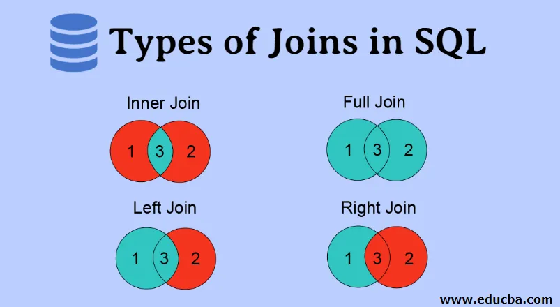

## **9. Запитання для співбесіди на тему Бази данних (database)**

---

- [1. Які бувають види БД](#1)
- [2. Визначте базу даних](#2)
- [3. Яка різниця між Системою управління базами даних (DBMS) і Реляційною Системою управління базами даних (RDBMS)](#3-dbms-rdbms)
- [4. Що таке SQL](#4-sql)
- [5. Що таке нормалізація і які її види](#5)
- [6. Що таке денормалізація](#6)
- [7. Що таке об'єднання (Joins) в SQL](#7-joins-sql)
- [8. Поясніть види об'єднань (Joins) в SQL](#8-joins-sql)
- [9. Які підмножини SQL існують](#9-sql)
- [10. Для чого застосовують SQL](#10-sql)
- [11. Що таке обмеження DEFAULT (DEFAULT constraint)](#11-default-default-constraint)
- [12. Що таке обмеження UNIQUE](#12-unique)
- [13. Що означає таблиця та поле в SQL](#13-sql)
- [14. Що таке первинний ключ](#14)
- [15. Що таке унікальний ключ](#15)
- [16. Чим первинний ключ відрізняється від унікального](#16)
- [17. Що таке зовнішній ключ](#17)
- [18. Які переваги бази даних SQL перед базою даних NoSQL](#18-sql-nosql)
- [19. Поясніть різні типи команд SQL](#19-sql)
- [20. Що таке індекс](#20)
- [21. Поясніть види індексів](#21)
- [22. Що таке сутності та зв’язки](#22)
- [23. Що таке оператори SQL](#23-sql)
- [24. Що ви маєте на увазі під цілісністю даних](#24)
- [25. Що таке сховище даних](#25)
- [26. Чому в SQL Server використовується функція FLOOR](#26-sql-server-floor)
- [27. Вкажіть відмінності між кластерними і некластерними індексами](#27)
- [28. Що ви знаєте про CDC у SQL Server](#28-cdc-sql-server)
- [29. Яка різниця між SQL і MySQL](#29-sql-mysql)
- [30. Вкажіть відмінності між SQL і PL/SQL](#30-sql-plsql)
- [31. Що таке властивість ACID у базі даних](#31-acid)
- [32. Для чого потрібні групові функції в SQL](#32-sql)
- [33. Що ви розумієте щодо функції маніпулювання символами](#33)
- [34. Що таке AUTO_INCREMENT](#34-auto_increment)
- [35. Яка різниця між командами DELETE і TRUNCATE](#36-delete-truncate)
- [36. Яка різниця між командами DROP і TRUNCATE](#36-drop-truncate)
- [37. Що таке «TRIGGER» у SQL](#37-trigger-sql)
- [38. Де зберігаються імена користувачів і паролі в SQL Server](#38-sql-server)
- [39. Які є типи зв’язків у базах даних SQL Server](#39-sql-server)
- [40. Які інструменти сторонніх виробників використовуються в SQL Server](#40-sql-server)
- [41. Як ви можете обробляти очікування в SQL Server](#41-sql-server)
- [42. Скільки режимів автентифікації існує в SQL Server](#42-sql-server)
- [43. Що таке функція в SQL Server](#43-sql-server)
- [44. Згадайте різні типи реплікації в SQL Server](#44-sql-server)
- [45. За допомогою якої команди можна дізнатися версію SQL Server](#45-sql-server)
- [46. Що таке функція COALESCE](#46-coalesce)
- [47. Чи можемо ми зв'язати SQL Server з іншими](#47-sql-server)
- [48. Що таке агент SQL Server](#48-sql-server)
- [49. Що ви знаєте про магічні таблиці в SQL Server](#49-sql-server)
- [50. Які типові пропозиції використовуються із запитами SELECT у SQL](#50-select-sql)
- [51. Що ви знаєте про функцію stuff()](#51-stuff)
- [52. Що таке погляди? Наведіть приклад](#52)
- [53. Які існують типи представлень у SQL](#53-sql)
- [54. Що таке збережена процедура](#54)
- [55. Поясніть внутрішнє з'єднання на прикладі](#55)
- [56. Вкажіть відмінності між видами(views) та таблицями](#56-views)
- [57. Що ви розумієте про тимчасовий стіл? Напишіть запит на створення тимчасової таблиці](#57)
- [58. Поясніть різницю між OLTP і OLAP](#58-oltp-olap)
- [59. Що таке гібридний OLAP](#59-olap)
- [60. Що ви розумієте під Self Join? Поясніть на прикладі](#60-self-join)
- [61. Яка різниця між операторами Union і Union All](#61-union-union-all)
- [62. Що таке курсор бази даних? Як користуватися курсором бази даних](#62)
- [63. Для чого корисний оператор INTERSECT](#63-intersect)
- [64. Як можна скопіювати дані з однієї таблиці в іншу](#64)
- [65. Яка різниця між операторами BETWEEN та IN у SQL](#65-between-in-sql)
- [66. Опишіть, як видалити повторювані рядки за допомогою одного оператора, але без створення таблиці](#66)
- [67. Яка різниця між реченнями HAVING і WHERE](#67-having-where)
- [68. Як можна створити порожні таблиці з тією ж структурою, що й інша таблиця](#68)
- [69. Що таке ER-діаграма в СУБД](#69-er-)
- [70. Що таке обмеження бази даних](#70)
- [71. Що таке резервна копія бази даних](#71)
- [72. Що таке відновлення бази даних](#72)
- [73. Що таке сурогатний ключ? Коли і для чого він використовується в СУБД](#73)
- [74. Що таке концепція сховища даних у СУБД](#74)
- [75. Чим розподілена база даних відрізняється від централізованої](#75)
- [76. Які є різні типи транзакцій бази даних](#76)
- [77. Поясніть архітектуру SQL](#77-sql)
- [78. Які є різні типи адміністрування бази даних](#78)
- [79. Які майбутні тенденції в технології баз даних](#79)
- [80. Які переваги використання об’єктно-орієнтованої системи керування базами даних](#80-)
- [81. Поясніть концепцію кешування бази даних та її переваги](#81)

---

## **Відповіді - 'Бази данних'**

### **1. Які бувають види БД**
[Back to top ⬆️](#9-database)  

<ul>
  <li>
    <strong>У світі баз даних існує кілька видів, кожен з яких має свої унікальні характеристики та застосування. Основні типи баз даних включають наступні:</strong>
    <ol>
      <li>
        <strong>Реляційні бази даних (RDBMS):</strong>
        <ul>
          <li>
            Приклади: MySQL, PostgreSQL, Oracle Database, Microsoft SQL Server.
          </li>
          <li>
            Основна характеристика: Даних зберігаються у вигляді таблиць, де взаємозв'язки між даними виражаються за допомогою ключів.
          </li>
          <li>
            Використання: Реляційні бази даних широко використовуються у більшості застосунків для зберігання структурованих даних.
          </li>
        </ul>
      </li>
      <li>
        <strong>Нереляційні (NoSQL) бази даних:</strong>
        <ul>
          <li>
            Приклади: MongoDB, Cassandra, Redis, CouchDB.
          </li>
          <li>
            Основна характеристика: Дані зберігаються без фіксованої схеми, часто у вигляді колекцій або документів, і можуть містити нереляційні дані.
          </li>
          <li>
            Використання: NoSQL бази даних використовуються для ситуацій, де потрібно зберігати великі обсяги даних, де схема може змінюватися, або де важливо швидкодія.
          </li>
        </ul>
      </li>
      <li>
        <strong>Колоночні бази даних:</strong>
        <ul>
          <li>
            Приклади: Amazon Redshift, Google Bigtable.
          </li>
          <li>
            Основна характеристика: Дані зберігаються у вигляді колонок, а не рядків, що дозволяє ефективно оптимізувати операції зчитування даних.
          </li>
          <li>
            Використання: Колоночні бази даних часто використовуються для аналізу великих обсягів даних або для зберігання даних із звітами.
          </li>
        </ul>
      </li>
      <li>
        <strong>Графові бази даних:</strong>
        <ul>
          <li>
            Приклади: Neo4j, Amazon Neptune.
          </li>
          <li>
            Основна характеристика: Дані представляються у вигляді графу, де вузли представляють об'єкти, а ребра - зв'язки між ними.
          </li>
          <li>
            Використання: Графові бази даних використовуються для моделювання та аналізу складних зв'язків між об'єктами, таких як соціальні мережі або географічні дані.
          </li>
        </ul>
      </li>
      <li>
        <strong>Інтернет-розподілені бази даних:</strong>
        <ul>
          <li>
            Приклади: Google Cloud Spanner, CockroachDB.
          </li>
          <li>
            Основна характеристика: Дозволяють розподіляти дані на різних серверах та географічних областях для підвищення доступності та швидкодії.
          </li>
          <li>
            Використання: Використовуються у великих та глобальних застосунках, де важлива масштабованість та надійність.
          </li>
        </ul>
      </li>
      <li>
        <strong>Часово-рядові бази даних:</strong>
        <ul>
          <li>
            Приклади: InfluxDB, TimescaleDB.
          </li>
          <li>
            Основна характеристика: Призначені для зберігання та оптимізації часових рядів даних, таких як логи, метеодані, моніторинг.
          </li>
          <li>
            Використання: Використовуються у сферах, де важливо аналізувати дані в часовому контексті.
          </li>
        </ul>
      </li>
      <li>
        <strong>Інмеморі бази даних:</strong>
        <ul>
          <li>
            Приклади: Redis, Memcached.
          </li>
          <li>
            Основна характеристика: Дані зберігаються у пам'яті, що забезпечує високу швидкодію доступу до них.
          </li>
          <li>
            Використання: Інмеморі бази даних використовуються для швидкого кешування та зберігання тимчасових даних.
          </li>
        </ul>
      </li>
    </ol>
  </li>
</ul>


### **2. Визначте базу даних**
[Back to top ⬆️](#9-database) 

База даних (Database) - це організована колекція структурованих даних, яка зберігається та управляється з метою ефективного доступу, пошуку та збереження інформації.  
Бази даних використовуються для зберігання різноманітної інформації, включаючи текст, числа, зображення, відео, аудіо та багато іншого.

Основні характеристики баз даних включають:

- **Таблиці**: Дані зазвичай зберігаються у вигляді таблиць з рядками та колонками.

- **Ключі**: Ключі використовуються для унікальної ідентифікації записів в таблицях.

- **Запити**: Запити дозволяють вибирати, оновлювати, видаляти та додавати дані до бази даних.

- **Система управління базами даних (СУБД)**: Для управління базою даних використовуються СУБД, такі як MySQL, PostgreSQL, Microsoft SQL Server, Oracle, MongoDB та інші.

- **Нормалізація**: Це процес організації даних у базі даних для зменшення дублювання та забезпечення цілісності даних.

- **Референції**: Зв'язки між таблицями дозволяють спільно використовувати дані і зменшують зайвий обсяг інформації.

- **Транзакції**: Транзакції забезпечують атомарність, цілісність і консистентність даних.

- **Індекси**: Індекси покращують швидкість пошуку та вибірки даних з бази даних.

- **Безпека доступу**: Бази даних зазвичай забезпечують механізми автентифікації та авторизації для забезпечення безпеки даних.

Загальна мета баз даних - забезпечити надійне та ефективне збереження, доступ та обробку даних для підтримки різних додатків і бізнес-процесів.


### **3. Яка різниця між Системою управління базами даних (DBMS) і Реляційною Системою управління базами даних (RDBMS)**
[Back to top ⬆️](#9-database) 

Система керування базою даних або СУБД — це системне програмне забезпечення, яке може створювати, отримувати, оновлювати та керувати базою даних.  
Він забезпечує узгодженість даних і стежить за тим, щоб вони були організовані та легкодоступні, діючи як інтерфейс між базою даних та її кінцевими користувачами або прикладним програмним забезпеченням.  
СУБД можна класифікувати на чотири типи:

* **Ієрархічна база даних:** має деревоподібну структуру, дані зберігаються в ієрархічному форматі. Батьківський елемент в ієрархічній базі даних може мати кілька дочірніх елементів, а дочірній — лише один. 
* **Мережева база даних:** цей тип бази даних представлено у вигляді графіка, який може мати зв’язки «багато-до-багатьох», що дозволяє об’єктам мати кілька з’єднань. 
* **Реляційна база даних:** це найпоширеніша та проста у використанні база даних. Він представлений у вигляді таблиці, а значення в стовпцях і рядках пов’язані одне з одним.
* **Об’єктно-орієнтована база даних:** значення даних і операції зберігаються як об’єкти в цьому типі бази даних, і ці об’єкти мають кілька зв’язків між собою.

РСУБД зберігає дані у формі набору таблиць.   
Відношення визначаються між спільними полями цих таблиць.  
MS SQL Server, MySQL, IBM DB2, Oracle і Amazon Redshift базуються на RDBMS.

| Параметри                                        | СУБД                                                          | РСУБД                                                                                                                   |
|--------------------------------------------------|---------------------------------------------------------------|-------------------------------------------------------------------------------------------------------------------------|
| Доступ                                           | До елементів даних потрібно звертатися окремо                 | Одночасно можна отримати доступ до кількох елементів даних                                                              |
| Зв'язок між даними                               | Немає зв'язку між даними                                      | Дані в таблицях пов’язані між собою                                                                                     |
| Нормалізація                                     | Його немає                                                    | Він присутній                                                                                                           |
| Розподілена база даних                           | Він не підтримує розподілені бази даних                       | Він підтримує розподілену базу даних                                                                                    |
| Формат зберігання даних                          | Дані зберігаються в навігаційній або ієрархічній формі        | Дані зберігаються в табличній структурі із заголовками, які є іменами стовпців, а рядки, що містять відповідні значення |
| Обсяг даних                                      | Він має справу з невеликою кількістю даних                    | Він має справу з більшою кількістю даних                                                                                |
| Надмірність даних                                | Це поширене                                                   | Ключі та індекси не допускають надмірності даних                                                                        |
| Кількість користувачів                           | Він підтримує одного користувача                              | Він підтримує кілька користувачів                                                                                       |
| Отримання даних                                  | Це повільніше для великих обсягів даних                       | Це швидко завдяки реляційному підходу                                                                                   |
| Безпека даних                                    | Низький рівень безпеки, коли йдеться про маніпулювання даними | Існує кілька рівнів захисту даних                                                                                       |
| Вимоги до програмного та апаратного забезпечення | Низький                                                       | Високий                                                                                                                 |
| Приклади                                         | XML, Window Registry тощо.                                    | MySQL, SQL Server, Oracle, [Microsoft Access](https://intellipaat.com/blog/what-is-microsoft-access/), PostgreSQL тощо. |


### **4. Що таке SQL**
[Back to top ⬆️](#9-database) 

SQL (Structured Query Language) - це стандартизована мова програмування для управління реляційними базами даних (RDBMS). SQL використовується для створення, зміни, видалення та вибірки даних з реляційних баз даних, таких як MySQL, PostgreSQL, Microsoft SQL Server, Oracle, SQLite та інші.

Основні характеристики SQL включають:

1. **Запити до баз даних**: SQL дозволяє виражати складні запити до баз даних для вибірки конкретних даних. Наприклад, ви можете використовувати команду `SELECT` для вибору даних з таблиці за певними умовами.

2. **Створення таблиць і баз даних**: SQL дозволяє створювати нові таблиці та бази даних для збереження інформації. Команда `CREATE TABLE` використовується для створення таблиці.

3. **Оновлення та видалення даних**: SQL дозволяє оновлювати та видаляти існуючі записи з таблиць за допомогою команд `UPDATE` і `DELETE`.

4. **Управління структурою бази даних**: SQL дозволяє змінювати структуру бази даних, додавати нові стовпці до таблиць, видаляти стовпці та змінювати їх типи даних.

5. **Забезпечення цілісності даних**: SQL дозволяє встановлювати обмеження цілісності даних, такі як унікальність ключів, зовнішні ключі та перевірки.

6. **Транзакції**: SQL підтримує транзакції для забезпечення атомарності, цілісності та консистентності даних під час виконання групи операцій.

7. **Індекси**: SQL дозволяє створювати індекси для покращення швидкості вибірки та пошуку даних.

SQL є надзвичайно важливим інструментом для роботи з реляційними базами даних і використовується в багатьох областях програмування та розробки додатків.


### **5. Що таке нормалізація і які її види**
[Back to top ⬆️](#9-database) 

Нормалізація - це процес організації структури реляційної бази даних (RDBMS) з метою зменшення дублювання даних та покращення цілісності та ефективності операцій з даними. Нормалізація допомагає уникнути проблем з вставкою, оновленням та видаленням даних, забезпечуючи, що дані зберігаються у бажаному стані.

Існує кілька нормальних форм (NF), які описують різні рівні нормалізації:

* **Перша нормальна форма (1NF)**:
     * Всі значення в кожній колонці таблиці є атомарними (недільними).
     * Кожен рядок (запис) має унікальний ідентифікатор (первинний ключ).

* **Друга нормальна форма (2NF)**:
     * Таблиця вже в 1NF.
     * Всі нетривіальні функціональні залежності від першинного ключа враховуються усередині таблиці.

* **Третя нормальна форма (3NF)**:
     * Таблиця вже в 2NF.
     * Всі нетривіальні функціональні залежності від першинного ключа не мають нічого спільного з іншими неключовими атрибутами.

* **Нормальна форма Бойса-Кодда (BCNF)**:
     * Таблиця вже в 3NF.
     * Кожна нетривіальна функціональна залежність від ключа має ключ як свою підмножину.

* **Четверта нормальна форма (4NF)**:
     * Таблиця вже в BCNF.
     * Забезпечує розкладання мультимножин атрибутів, які мають багато значень для одного ключа.

* **П'ята нормальна форма (5NF) або проекція-долонька (PJ/NF)**:
     * Таблиця вже в 4NF.
     * Розкладання мультимножини вартостей атрибутів, що залежать від двох або більше ключів.

* **Десята нормальна форма (6NF)**:
     * Розширена версія 5NF, яка враховує всі можливі залежності між атрибутами.

Нормалізація допомагає уникнути аномалій управління даними та забезпечує консистентність даних в реляційних базах даних. Вибір рівня нормалізації залежить від конкретних потреб та характеристик додатка, що використовує базу даних.


### **6. Що таке денормалізація**
[Back to top ⬆️](#9-database)

Денормалізація - це процес об'єднання або зведення даних в реляційній базі даних з метою покращення продуктивності та оптимізації виконання запитів, а також спрощення роботи з базою даних для певних використань. В основному, денормалізація використовується для зменшення кількості з'єднань (JOIN) та запитів до бази даних.

Основні причини для застосування денормалізації включають:

1. **Покращення продуктивності**: В деяких ситуаціях здійснення з'єднань між багатьма таблицями може призвести до погіршення продуктивності запитів. Денормалізація дозволяє уникнути цього, зберігаючи пов'язані дані разом в одній таблиці.

2. **Спрощення запитів**: Запити до денормалізованих таблиць можуть бути більш зрозумілими та менш складними, оскільки вони не вимагають багатьох з'єднань.

3. **Зменшення обсягу даних**: У денормалізованих таблицях можна зберігати копії даних, які можуть дублюватися в нормалізованих таблицях. Це може зменшити обсяг даних, які потрібно зчитувати з бази даних.

4. **Підтримка звітів і аналітики**: Денормалізовані дані можуть бути корисні для побудови звітів і аналітичних даних, оскільки вони можуть бути більш підходящими для певних видів аналізу.

Однак денормалізація також має свої недоліки. Вона може призвести до збільшення об'єму даних, погіршення цілісності даних та складнішого керування даними при оновленні або видаленні. Тому при реалізації денормалізації важливо ретельно розглядати специфічні потреби і вимоги вашого додатка та забезпечувати належний контроль над даними.


### **7. Що таке об'єднання (Joins) в SQL**
[Back to top ⬆️](#9-database) 

Об'єднання (Joins) в SQL - це операції, які використовуються для об'єднання рядків з двох або більше таблиць в один результат запиту на основі певного умовного зв'язку між ними. Об'єднання є потужним інструментом для отримання даних з різних джерел та поєднання їх для аналізу, фільтрації та відображення.

Основні види об'єднань в SQL включають:

1. **INNER JOIN**: Повертає рядки, які мають відповідні значення в об'єднуваних таблицях. Якщо немає відповідних значень, то цей рядок не включається у вихідний результат.

2. **LEFT JOIN (или LEFT OUTER JOIN)**: Повертає всі рядки з першої (лівої) таблиці та відповідні рядки з другої (правої) таблиці. Якщо немає відповідних значень у другій таблиці, то в результаті буде `NULL` значення.

3. **RIGHT JOIN (или RIGHT OUTER JOIN)**: Повертає всі рядки з другої (правої) таблиці та відповідні рядки з першої (лівої) таблиці. Якщо немає відповідних значень у першій таблиці, то в результаті буде `NULL` значення.

4. **FULL OUTER JOIN**: Повертає всі рядки з обох таблиць, включаючи ті, які мають відповідність та ті, які не мають. Якщо немає відповідних значень у будь-якій з таблиць, то в результаті буде `NULL` значення.

5. **CROSS JOIN**: Використовується для отримання комбінацій кожного рядка з першої таблиці з кожним рядком з другої таблиці. В результаті отримується декартовий добуток об'єднаних таблиць.

6. **SELF JOIN**: Використовується для об'єднання таблиці з самою собою. Це може бути корисним, наприклад, для обробки ієрархічних даних.

Умови об'єднання задаються за допомогою `ON` або `USING` (для підходів `NATURAL JOIN`) виразів, які вказують, які стовпці в об'єднаних таблицях повинні взаємодіяти. Об'єднання дозволяє отримувати більш складні та пов'язані дані, які можуть бути важливими для багатьох видів аналізу та запитів до бази даних.


### **8. Поясніть види об'єднань (Joins) в SQL**
[Back to top ⬆️](#9-database) 

Об'єднання (Joins) в SQL - це операції, які дозволяють комбінувати дані з двох або більше таблиць на основі спільних стовпців або умов для створення нового результуючого набору даних. В SQL існують різні види об'єднань, кожен з яких використовується в певних випадках залежно від потреб запиту та структури даних. Основні види об'єднань включають:

1. **INNER JOIN**: Це найпоширеніший вид об'єднання. Він повертає лише рядки, які мають спільні значення в об'єднуваних таблицях за вказаним умовним виразом. Якщо немає відповідних значень, то ці рядки виключаються з результату.

2. **LEFT JOIN (або LEFT OUTER JOIN)**: Це об'єднання, яке повертає всі рядки з першої (лівої) таблиці і тільки ті рядки з другої (правої) таблиці, які мають відповідні значення за умовним виразом. Якщо немає відповідних значень в правій таблиці, то в результаті буде `NULL` значення для стовпців з правої таблиці.

3. **RIGHT JOIN (або RIGHT OUTER JOIN)**: Схожий на LEFT JOIN, але він повертає всі рядки з другої (правої) таблиці та тільки ті рядки з першої (лівої) таблиці, які мають відповідні значення за умовним виразом. Якщо немає відповідних значень в лівій таблиці, то в результаті буде `NULL` значення для стовпців з лівої таблиці.

4. **FULL OUTER JOIN**: Це об'єднання, яке повертає всі рядки з обох таблиць і включає значення з обох сторін. Якщо немає відповідних значень в будь-якій з таблиць, то в результаті буде `NULL` значення для відсутніх даних.

5. **CROSS JOIN**: Це об'єднання, яке створює декартовий добуток всіх можливих комбінацій рядків з обох таблиць. Він не використовує умовний вираз і повертає всі можливі пари значень.

6. **SELF JOIN**: Це об'єднання, в якому таблиця об'єднується з самою собою. Це використовується для обробки ієрархічних даних або взаємозв'язаних записів в одній таблиці.

Обираючи тип об'єднання, важливо враховувати власні потреби та структуру даних в вашому запиті, оскільки кожен вид об'єднання має свої властивості та впливає на результат запиту.




### **9. Які підмножини SQL існують**
[Back to top ⬆️](#9-database) 

SQL (Structured Query Language) має декілька підмножин або діалектів, кожен з яких розроблений для певної бази даних або системи керування базами даних (СКБД). Основні підмножини SQL включають:

1. **Transact-SQL (T-SQL)**: Це діалект SQL, розроблений компанією Microsoft для використання з їхньою системою керування базами даних Microsoft SQL Server. T-SQL включає додаткові функції та можливості, які не знайдете в стандартному SQL, такі як збережені процедури та тригери.

2. **PL/SQL**: Це діалект SQL, розроблений компанією Oracle для використання з їхньою системою керування базами даних Oracle. PL/SQL додає можливості програмування до SQL і включає в себе процедури, функції та пакети для роботи з даними.

3. **MySQL**: MySQL має свій власний діалект SQL, який є відкритим та широко використовується у різних додатках та веб-серверах.

4. **PostgreSQL**: PostgreSQL також має свій власний діалект SQL і володіє додатковими можливостями, такими як підтримка JSON, геопросторові операції і багато іншого.

5. **SQLite**: SQLite використовує стандартний SQL зі своїми особливостями. Він є легковаговим СКБД, який зазвичай використовується для вбудованих додатків та мобільних додатків.

6. **ANSI SQL (SQL-92, SQL-99, SQL:2003 і т.д.)**: ANSI SQL - це стандартний SQL, який розроблений американським інститутом національних стандартів (ANSI) і міжнародною організацією ISO. Він визначає базовий синтаксис та операції SQL, які повинні бути підтримані у всіх СКБД.

Кожен з цих діалектів має свої особливості та можливості, але базові SQL-запити, такі як SELECT, INSERT, UPDATE та DELETE, залишаються спільними для всіх них.

---

- **Мова визначення даних (DDL)**
  Запити DDL складаються з команд SQL, які можна використовувати для визначення структури бази даних і її зміни.

  - **CREATE:** створює бази даних, таблиці, схеми тощо.
  - **DROP:** видаляє таблиці та інші об’єкти бази даних.
  - **ВИДАЛИТИ СТОВПЕЦЬ:** Вилучає стовпець із будь-якої структури таблиці.
  - **ALTER:** змінює визначення об’єктів бази даних.
  - **TRUNCATE:** видаляє таблиці, подання, процедури та інші об’єкти бази даних.
  - **ДОДАТИ СТОВПЕЦЬ:** додає будь-який стовпець до схеми таблиці.

- **Мова обробки даних (DML)**
  Ці SQL-запити використовуються для маніпулювання даними в базі даних.

  - **SELECT INTO:** Вибирає дані з однієї таблиці та вставляє їх в іншу.
  - **INSERT:** вставляє дані або записи в таблицю.
  - **ОНОВЛЕННЯ:** оновлює значення будь-якого запису в базі даних.
  - **DELETE:** видаляє записи з таблиці.

- **Мова керування даними (DCL)**
  Ці SQL-запити керують правами доступу та керуванням дозволами бази даних.

  - **GRANT:** Надає права доступу до об’єктів бази даних.
  - **REVOKE:** скасовує дозвіл для об’єктів бази даних.

- **Мова керування транзакціями (TCL)**
  TCL — це набір команд, який, по суті, керує транзакціями в базі даних і змінами, внесеними операторами DML. TCL дозволяє групувати оператори в логічні транзакції.

  - **КОМІТ:** Фіксує незворотню транзакцію, тобто попередній образ бази даних до транзакції неможливо отримати. Коли транзакція фіксується за допомогою оператора COMMIT у SQL, вона назавжди зберігає зміни, зроблені в межах транзакції, у базі даних. Після внесення змін неможливо відкотити або скасувати, а попередній стан бази даних до транзакції не можна отримати без відновлення з резервної копії або використання інших методів відновлення даних.
  - **ROLLBACK:** повертає кроки транзакції у разі помилки.
  - **SAVEPOINT:** встановлює точку збереження в транзакції, до якої можна виконати відкат.
  - **ВСТАНОВИТИ ТРАНЗАКЦІЮ:** встановлює характеристики транзакції.


### **10. Для чого застосовують SQL**
[Back to top ⬆️](#9-database) 

SQL (Structured Query Language) використовується для взаємодії з базами даних та виконання різних операцій з даними.  
Основні цілі та області застосування SQL включають:

1. **Управління даними**: SQL дозволяє створювати, зчитувати, оновлювати та видаляти дані в базі даних. Це важливо для зберігання та організації інформації.

2. **Запити до даних**: SQL дозволяє формулювати складні запити до бази даних, щоб отримувати потрібну інформацію. Це корисно для вибірки конкретних даних з великих наборів даних.

3. **Агрегація даних**: SQL дозволяє обчислювати агрегатні функції, такі як SUM, AVG, MAX, MIN та інші, для аналізу даних.

4. **Фільтрація даних**: SQL дозволяє фільтрувати дані на основі певних умов, щоб виділити певну підмножину записів.

5. **З'єднання даних**: SQL дозволяє об'єднувати дані з різних таблиць за допомогою операції JOIN, щоб отримати пов'язану інформацію.

6. **Сортування даних**: SQL дозволяє сортувати дані в певному порядку за вказаними стовпцями.

7. **Створення та модифікація структури таблиць**: SQL дозволяє створювати нові таблиці, модифікувати їх структуру (додавати стовпці, видаляти стовпці) та визначати обмеження на дані.

8. **Створення звітів і аналітика**: SQL може бути використаний для створення звітів, аналізу даних та візуалізації результатів запитів.

9. **Інтеграція з програмним забезпеченням**: SQL може використовуватися для взаємодії з програмним забезпеченням, таким як веб-додатки, сервери та інші додатки, щоб забезпечити доступ до даних.

10. **Забезпечення цілісності даних**: SQL дозволяє встановлювати обмеження та правила для забезпечення цілісності та безпеки даних в базі даних.

Загалом, SQL є потужним мовою запитів, яка використовується в різних сферах, включаючи розробку програмного забезпечення, адміністрування баз даних, аналіз даних та багато інших галузей.


### **11. Що таке обмеження DEFAULT (DEFAULT constraint)**
[Back to top ⬆️](#9-database) 

Обмеження DEFAULT (DEFAULT constraint) в SQL використовується для встановлення значення за замовчуванням для стовпця в таблиці в разі, якщо при вставці нового запису не вказане конкретне значення для цього стовпця. 

Основні характеристики та використання обмеження DEFAULT:

1. **Значення за замовчуванням**: Обмеження DEFAULT визначає значення, яке буде автоматично встановлено в стовпці, якщо вставка нового запису не включає вказання значення для цього стовпця.

2. **Застосування до різних типів стовпців**: Обмеження DEFAULT може бути використано для стовпців різних типів даних, таких як числа, рядки, дати тощо.

3. **Зручність в роботі з базою даних**: Використання обмежень DEFAULT полегшує роботу з базою даних, оскільки ви можете встановити значення за замовчуванням для стовпця один раз, і це значення буде використовуватися автоматично при кожній вставці даних.

4. **Захист від введення некоректних або відсутніх даних**: Обмеження DEFAULT може захищати базу даних від введення некоректних або відсутніх даних в стовпці, забезпечуючи значення за замовчуванням в разі необхідності.

5. **Можливість зміни значення за замовчуванням**: Ви можете змінити значення за замовчуванням для стовпця в майбутньому, якщо це потрібно.

Приклад визначення обмеження DEFAULT:

```sql
CREATE TABLE employees (
    employee_id INT PRIMARY KEY,
    first_name VARCHAR(50),
    last_name VARCHAR(50),
    hire_date DATE,
    salary DECIMAL(10, 2) DEFAULT 0.00
);
```

У цьому прикладі створюється таблиця "employees" зі стовпцем "salary", який має значення за замовчуванням 0.00.  
Якщо при вставці нового запису не вказане значення для "salary", то встановиться значення за замовчуванням 0.00.


### **12. Що таке обмеження UNIQUE**
[Back to top ⬆️](#9-database) 

Обмеження UNIQUE в базі даних використовується для забезпечення унікальності значень у певному стовпці або групі стовпців в таблиці. Це означає, що в цих стовпцях не може бути дубльованих значень. Якщо спроба вставити або оновити запис так, що він містить значення, яке вже існує в цьому стовпці, то така операція буде відхилена базою даних з помилкою.

Ось приклад, який демонструє, як створити обмеження UNIQUE для стовпця "email" у таблиці "users":

```sql
CREATE TABLE users (
    user_id INT PRIMARY KEY,
    username VARCHAR(50) UNIQUE, -- Обмеження UNIQUE для стовпця "username"
    email VARCHAR(100) UNIQUE    -- Обмеження UNIQUE для стовпця "email"
);
```

У цьому прикладі обмеження UNIQUE встановлено для стовпця "username" і стовпця "email". Тепер жодні два користувача не можуть мати однаковий "username" або "email". Якщо спроба вставити такі дані:

```sql
INSERT INTO users (user_id, username, email) VALUES (1, 'john_doe', 'john@example.com');
INSERT INTO users (user_id, username, email) VALUES (2, 'jane_smith', 'john@example.com'); -- Помилка! Дубльоване значення email
```

Операція вставки для користувача "jane_smith" буде відхилена через обмеження UNIQUE, оскільки значення "john@example.com" вже існує в стовпці "email".


### **13. Що означає таблиця та поле в SQL**
[Back to top ⬆️](#9-database)

У SQL, таблиця та поле (іноді називають колонкою) - це ключові поняття, які використовуються для організації та зберігання даних в базі даних.

1. **Таблиця (Table):**
   - Таблиця є основною структурою для зберігання даних в базі даних.
   - Вона представляє собою сукупність даних, організованих у вигляді рядків і стовпців.
   - Кожен рядок в таблиці називається записом або кортежем, і він представляє собою конкретний набір даних.
   - Стовпці таблиці визначають типи даних та імена полів, які зберігають дані.

   Приклад створення таблиці "employees" зі стовпцями "employee_id", "first_name" та "last_name":

   ```sql
   CREATE TABLE employees (
       employee_id INT PRIMARY KEY,
       first_name VARCHAR(50),
       last_name VARCHAR(50)
   );
   ```

2. **Поле (Field або Column):**
   - Поле є одним із стовпців в таблиці, яке визначає тип даних та ім'я для конкретного атрибуту.
   - Кожен стовпець (поле) в таблиці має свою назву та тип даних, які вказують, які дані можна зберігати у цьому стовпці.

   У таблиці "employees" вище, "employee_id", "first_name" і "last_name" - це приклади полів:
   - "employee_id" - це INT, що означає, що в цьому стовпці можна зберігати цілі числа.
   - "first_name" і "last_name" - це VARCHAR(50), що означає, що в цих стовпцях можна зберігати рядки тексту довжиною до 50 символів.

Поля (стовпці) в таблиці використовуються для зберігання конкретних типів інформації, таких як імена, адреси, номери телефонів тощо, а таблиця в цілому представляє собою структуру для організації та зберігання цих даних.


### **14. Що таке первинний ключ**
[Back to top ⬆️](#9-database)

Первинний ключ (Primary Key) - це унікальний ідентифікатор для кожного запису (рядка) в таблиці бази даних. Головна функція первинного ключа полягає в тому, щоб однозначно ідентифікувати кожен запис у таблиці та забезпечувати його унікальність. Основні характеристики первинного ключа включають наступне:

1. **Унікальність:** Кожне значення первинного ключа повинно бути унікальним в межах таблиці. Це означає, що не може бути двох записів з однаковими значеннями первинного ключа.

2. **Не пустий (Not Null):** Значення первиного ключа не може бути нульовим або порожнім (null). Кожен запис повинен мати значення первинного ключа.

3. **Не змінюється (Immutable):** Зазвичай значення первинного ключа не змінюється протягом існування запису. Якщо виникає необхідність змінити ключ, це може призвести до видалення і створення нового запису.

4. **Використання для пошуку:** Первинний ключ використовується для швидкого пошуку конкретних записів у таблиці.

Приклад створення таблиці з первинним ключем:

```sql
CREATE TABLE students (
    student_id INT PRIMARY KEY,
    first_name VARCHAR(50),
    last_name VARCHAR(50),
    date_of_birth DATE
);
```

У цьому прикладі "student_id" є полем, яке встановлено як первинний ключ. Кожен студент буде ідентифікований унікальним значенням "student_id". Це дозволяє ефективно знаходити та змінювати інформацію про кожного студента в таблиці.


### **15. Що таке унікальний ключ**
[Back to top ⬆️](#9-database)

Унікальний ключ (Unique Key) в SQL - це обмеження, яке використовується для забезпечення унікальності значень у стовпці або групі стовпців в таблиці, подібно до первинного ключа. Основна відмінність між унікальним ключем і первинним ключем полягає в тому, що у таблиці може бути лише один первинний ключ, в той час як унікальних ключів може бути більше одного.

Основні характеристики унікального ключа включають:

1. **Унікальність:** Кожне значення унікального ключа повинно бути унікальним в межах таблиці. Це означає, що не може бути двох записів з однаковими значеннями унікального ключа.

2. **Може бути нульовим (Nullable):** Значення унікального ключа може бути нульовим (null), що означає, що декілька записів можуть мати нульові значення в цьому стовпці.

3. **Не обов'язково для ідентифікації:** Унікальний ключ не обов'язково використовується для ідентифікації записів, як це робить первинний ключ. Він може бути використаний для забезпечення унікальності значень в конкретному стовпці або комбінації стовпців без необхідності ідентифікації запису.

Приклад створення таблиці з унікальним ключем:

```sql
CREATE TABLE products (
    product_id INT PRIMARY KEY,
    product_name VARCHAR(100) UNIQUE, -- Унікальний ключ для стовпця "product_name"
    price DECIMAL(10, 2)
);
```

У цьому прикладі "product_name" є стовпцем з унікальним ключем. Це означає, що кожен продукт буде мати унікальне ім'я в межах таблиці "products", але це ім'я не обов'язково використовується для ідентифікації продукту, як це робить "product_id" (первинний ключ).


### **16. Чим первинний ключ відрізняється від унікального**
[Back to top ⬆️](#9-database)

Первинний ключ і унікальний ключ мають схожу функцію - забезпечення унікальності значень в стовпцях таблиці. Ось основні відмінності між ними:

* **Кількість ключів:**
     * **Первинний ключ:** У таблиці може бути лише один первинний ключ. Цей ключ однозначно ідентифікує кожен запис у таблиці і є основним ключем для цієї таблиці.
     * **Унікальний ключ:** У таблиці може бути декілька унікальних ключів. Кожен унікальний ключ забезпечує унікальність значень в певному стовпці або комбінації стовпців, але не обов'язково ідентифікує кожен запис.

* **Використання для ідентифікації:**
     * **Первинний ключ:** Використовується для однозначної ідентифікації кожного запису в таблиці. Це основний ключ, який служить для посилання на записи з інших таблиць (зовнішні ключі).
     * **Унікальний ключ:** Забезпечує унікальність значень в стовпці або групі стовпців, але не обов'язково використовується для ідентифікації записів. Він може використовуватися для забезпечення унікальності даних без необхідності посилання на інші таблиці.

* **Можливість бути нульовим:**
     * **Первинний ключ:** Зазвичай не допускає нульових (null) значень. Кожен запис повинен мати значення первинного ключа.
     * **Унікальний ключ:** Може бути налаштованим так, щоб дозволяти нульові значення, якщо це необхідно.

* **Значення ключа:**
     * **Первинний ключ:** Зазвичай використовується для ідентифікації записів у таблиці і може бути створений автоматично (наприклад, автоінкрементне поле).
     * **Унікальний ключ:** Використовується для забезпечення унікальності даних в конкретному стовпці або комбінації стовпців, і значення немають обов'язково ідентифікувати записи.

* **Обмеження на кількість записів з однаковими значеннями:**
     * **Первинний ключ:** Немає обмежень на кількість записів з однаковими значеннями в первинному ключі, так як кожен запис повинен бути унікальним.
     * **Унікальний ключ:** Дозволяє тільки однакові значення один раз. Якщо спробувати вставити запис із значенням, яке вже існує в унікальному ключі, то вставка буде відхилена.

Обираючи між первинним і унікальним ключем, слід враховувати потреби вашої бази даних та вимоги до унікальності ідентифікаторів.


### **17. Що таке зовнішній ключ**
[Back to top ⬆️](#9-database)

Зовнішній ключ (Foreign Key) в SQL - це стовпець або група стовпців у таблиці, які посилаються на первинний ключ іншої таблиці. Зовнішні ключі встановлюють відносини між таблицями, дозволяючи одній таблиці посилатися на дані в іншій таблиці. Основна ціль використання зовнішнього ключа - забезпечити цілісність даних та відносини між таблицями.

Основні характеристики зовнішнього ключа:

1. **Посилання на первинний ключ:** Зовнішній ключ вказує на первинний ключ іншої (батьківської) таблиці. Це означає, що значення зовнішнього ключа в початковій таблиці повинні існувати в батьківській таблиці як первинні ключі.

2. **Забезпечення цілісності даних:** Зовнішній ключ забезпечує цілісність даних, не дозволяючи створювати посилання на неіснуючі записи в батьківській таблиці. Це допомагає уникнути "сирого" даних і зберігає правильність відносин між таблицями.

3. **Дії при оновленні та видаленні:** Зазвичай при роботі з зовнішніми ключами можна вказати, як система має поводитися при оновленні або видаленні записів в батьківській таблиці. Зазвичай доступні такі дії:
   - CASCADE: Всі пов'язані записи в дочірній таблиці також оновлюються або видаляються.
   - SET NULL: Значення зовнішнього ключа в дочірній таблиці встановлюється в NULL.
   - SET DEFAULT: Значення зовнішнього ключа встановлюється в значення за замовчуванням.
   - NO ACTION: Нічого не робиться, і виникає помилка, якщо є залежні записи.
   - RESTRICT: Спрощена версія NO ACTION, яка також видає помилку при наявності залежних записів.

4. **Звільнення від неефективних запитів:** Зовнішні ключі дозволяють здійснювати з'єднання (JOIN) між таблицями на основі відносин, що покращує можливості вибірки та обробки даних.

Приклад створення таблиці з зовнішнім ключем:

```sql
CREATE TABLE orders (
    order_id INT PRIMARY KEY,
    customer_id INT,
    order_date DATE,
    FOREIGN KEY (customer_id) REFERENCES customers(customer_id)
);
```

У цьому прикладі створюється таблиця "orders" з зовнішнім ключем "customer_id," який посилається на таблицю "customers" за її первинним ключем "customer_id." Цей зовнішній ключ вказує на те, що кожне замовлення (у таблиці "orders") пов'язане з певним клієнтом (у таблиці "customers").


### **18. Які переваги бази даних SQL перед базою даних NoSQL**
[Back to top ⬆️](#9-database)

SQL та NoSQL є двома різними типами систем управління базами даних (СУБД), і у них є свої власні переваги та недоліки. Ось деякі переваги бази даних SQL порівняно з базою даних NoSQL:

1. **Структурованість даних:** Бази даних SQL вимагають схеми даних, яка визначає, які типи даних та які відносини між ними будуть зберігатися. Це забезпечує вищий рівень структурованості та цілісності даних. Схема дозволяє визначити, як дані будуть представлені та збережені в таблицях.

2. **Транзакції:** SQL-бази даних підтримують транзакції, які гарантують атомарність, цілісність та стійкість даних. Це особливо важливо в додатках, де важливо, щоб всі операції були виконані або жодна з них не була виконана.

3. **Складний запит:** SQL надає багатий мову запитів, яка дозволяє вибирати, фільтрувати, з'єднувати та агрегувати дані з різних таблиць. Це дає змогу виконувати складні операції обробки даних безпосередньо в базі даних.

4. **Зв'язки між даними:** В SQL легко встановлювати зв'язки між даними за допомогою зовнішніх ключів та таблиць-справочників. Це дозволяє структурувати та нормалізувати дані для зменшення дублювання і забезпечення їх цілісності.

5. **Підтримка ACID:** SQL-бази даних дотримуються принципів ACID (Атомарність, Цілісність, Споживачисть, Довіреність), що забезпечує стійкість та надійність даних у вимогливих застосунках.

6. **Запити для аналітики:** SQL-бази даних зазвичай підтримують інструменти для виконання аналітичних запитів, таких як OLAP (аналіз онлайн за допомогою обробки даних) та засоби для створення звітів.

7. **Безпека даних:** SQL-бази даних надають докладні засоби для управління доступом до даних і захисту від несанкціонованого доступу.

8. **Завершеність операцій:** SQL гарантує, що всі операції на додавання, оновлення або видалення даних будуть завершені, навіть у випадку виникнення помилок.

9. **Великий екосистем:** SQL має широкий вибір реляційних СУБД (таких як MySQL, PostgreSQL, Oracle, SQL Server тощо) та інструментів для розробки та адміністрування баз даних.

Проте слід відзначити, що вибір між SQL та NoSQL залежить від конкретних потреб проекту. NoSQL може бути кращим варіантом для проектів з великим обсягом неструктурованих даних або коли важливі швидкодія та масштабованість.


### **19. Поясніть різні типи команд SQL**
[Back to top ⬆️](#9-database)

SQL (Structured Query Language) має кілька основних типів команд, які використовуються для взаємодії з базами даних. Ось огляд різних типів команд SQL:

1. **DDL (Data Definition Language - Мова визначення даних):**
     - `CREATE`: Створює нові об'єкти бази даних, такі як таблиці, індекси, представлення та схеми.
     - `ALTER`: Змінює структуру об'єктів бази даних, наприклад, додає, змінює або видаляє стовпці в таблиці.
     - `DROP`: Видаляє об'єкти бази даних, такі як таблиці або індекси.
     - `TRUNCATE`: Швидко видаляє всі записи з таблиці, але залишає саму таблицю.

2. **DML (Data Manipulation Language - Мова обробки даних):**
     - `SELECT`: Вибирає дані з таблиці. Це найчастіше використовувана команда для витягнення даних з бази даних.
     - `INSERT`: Додає нові записи до таблиці.
     - `UPDATE`: Оновлює існуючі записи в таблиці.
     - `DELETE`: Видаляє записи з таблиці.

3. **DCL (Data Control Language - Мова керування даними):**
     - `GRANT`: Надає права доступу до об'єктів бази даних користувачам.
     - `REVOKE`: Скасовує права доступу, які були надані раніше.

4. **TCL (Transaction Control Language - Мова керування транзакціями):**
     - `COMMIT`: Фіксує всі зміни, внесені в рамках поточної транзакції, і зберігає їх в базі даних.
     - `ROLLBACK`: Відміняє всі зміни, внесені в рамках поточної транзакції, і повертає базу даних до попереднього стану.
     - `SAVEPOINT`: Встановлює точку збереження в транзакції, до якої можна відкотити зміни, якщо щось піде не так.
     - `SET TRANSACTION`: Встановлює характеристики транзакції, такі як рівень ізоляції.

Ці команди дозволяють виконувати широкий спектр дій у базах даних, від створення та модифікації структури даних до операцій з обробки та керуванням даними.    


### **20. Що таке індекс**
[Back to top ⬆️](#9-database)

Індекс в базі даних - це структура даних, яка дозволяє ефективно виконувати пошук і швидко доступатися до записів в таблиці. Індекси створюються на одному або кількох стовпцях таблиці і допомагають покращити продуктивність операцій, таких як SELECT, JOIN та WHERE-умови. Основна перевага використання індексів полягає в тому, що вони дозволяють базі даних уникнути повного перегляду кожного рядка таблиці під час виконання запитів.

Основні характеристики індексів:

1. **Швидший доступ до даних**: Індекси роблять пошук більш ефективним, оскільки вони дозволяють базі даних звертатися до конкретних рядків без перегляду всієї таблиці.

2. **Покращення продуктивності**: Запити, які використовують індекси, виконуються швидше, що поліпшує загальну продуктивність системи.

3. **Підвищення швидкості JOIN-операцій**: Індекси на зовнішніх ключах дозволяють підвищити швидкість JOIN-операцій, коли з'єднується інформація з різних таблиць.

4. **Вартість зберігання індексів**: Індекси займають додатковий простір на диску, і їх підтримка може збільшити обсяг пам'яті, необхідний для зберігання бази даних. Тому слід розглядати баланс між швидкодією та вартістю зберігання при створенні індексів.

При створенні індексів слід враховувати потреби запитів, які використовуються в системі, і вибирати стовпці для індексування з урахуванням цих запитів. Хоча індекси поліпшують продуктивність, надмірне їх використання може призвести до збільшення обсягу дискового простору та сповільнення процесу вставки, оновлення та видалення записів в таблицях.

### **21. Поясніть види індексів**
[Back to top ⬆️](#9-database)

У SQL існують різні типи індексів, які можуть бути створені для покращення продуктивності запитів та оптимізації доступу до даних. Ось деякі з найпоширеніших видів індексів:

1. **B-Tree (Binary Tree) Index:**
     - B-Tree індекс є найпоширенішим типом індексу в SQL.
     - Він створює бінарне дерево, в якому кожен вузол має два дочірніх вузла.
     - Використовується для швидкого пошуку точних значень стовпців.

2. **Unique Index:**
     - Цей індекс обмежує значення стовпця таблиці, які можуть бути унікальними (не повторюються).
     - Використовується для забезпечення унікальності значень у вказаному стовпці або групі стовпців.

3. **Primary Key Index:**
     - Primary Key (первинний ключ) - це унікальний індекс, який ідентифікує унікальну запис у таблиці.
     - Вимагає, щоб кожне значення в цьому стовпці було унікальним та не може бути NULL.

4. **Clustered Index:**
     - Цей тип індексу фактично впорядковує дані в таблиці на основі значень індексованого стовпця.
     - У таблиці може бути лише один кластерний індекс.
     - Використовується для забезпечення фізичного впорядкування даних.

5. **Non-Clustered Index:**
     - Цей індекс не впорядковує самі дані, а створює окрему структуру, де зберігаються вказівники на рядки в таблиці.
     - У таблиці може бути декілька не кластерних індексів.

6. **Full-Text Index:**
     - Використовується для повнотекстового пошуку, де можна шукати слова або фрази в текстових стовпцях.
     - Покращує продуктивність пошуку великих обсягів текстових даних.

7. **Bitmap Index:**
     - Цей тип індексу використовує бітові маски для представлення інформації про те, які значення з'являються у стовпці.
     - Зазвичай використовується для стовпців з обмеженим числом унікальних значень, таких як стать або статус.

8. **Spatial Index:**
     - Використовується для оптимізації запитів на роботу з геопросторовими даними, такими як картографічні координати.

9. **Covering Index:**
     - Цей індекс містить всі стовпці, які використовуються в певному запиті.
     - Покращує продуктивність запитів, оскільки всі необхідні дані знаходяться в самому індексі, і база даних не мусить читати основну таблицю.

Вибір типу індексу залежить від конкретних вимог до бази даних та типів запитів, які виконуються. Найкращий тип індексу може варіюватися в залежності від контексту і вимог до продуктивності.


### **22. Що таке сутності та зв’язки**
[Back to top ⬆️](#9-database)

У контексті баз даних і реляційних моделей даних терміни "сутність" і "зв'язок" використовуються для опису структури та взаємозв'язків між об'єктами у системі. Давайте розглянемо їх докладніше:

1. **Сутність (Entity):**
     - Сутність представляє собою об'єкт або поняття, яке має важливу інформацію, яка зберігається в базі даних.
     - Наприклад, якщо ви розробляєте базу даних для каталогу книг, то сутностями можуть бути "Книга", "Автор", "Видавництво" і т. д.
     - Кожна сутність має атрибути, які описують її характеристики. Наприклад, у сутності "Книга" можуть бути атрибути, такі як "Назва", "Автор", "Рік видання" і т. д.

2. **Зв'язок (Relationship):**
     - Зв'язок вказує на взаємозв'язок між двома або більше сутностями в базі даних.
     - Він показує, як і якім чином сутності пов'язані одна з одною і як дані між ними обмінюються.
     - Зв'язки можуть бути однапрямленими або двонапрямленими, і вони мають ступінь взаємозв'язку (наприклад, один-до-одного, один-до-багатьох, багато-до-багатьох).

Наприклад, у базі даних для каталогу книг може бути такий зв'язок:

- Сутність "Книга" має зв'язок із сутністю "Автор", оскільки кожна книга пов'язана з одним або більшими авторами.
- Зв'язок може мати атрибути, такі як "Дата написання" або "Роль автора" у відношенні між книгою і автором.

Зв'язки допомагають організовувати та уточнювати структуру бази даних і визначають, як дані пов'язані між собою, що робить їх потужним інструментом для моделювання та роботи з даними.


### **23. Що таке оператори SQL**
[Back to top ⬆️](#9-database)

Оператори SQL - це спеціальні ключові слова або символи, які виконують певні операції. Вони також використовуються в SQL-запитах. Ці оператори можуть використовуватися в реченні WHERE в командах SQL. На основі заданої умови оператори SQL фільтрують дані.

Оператори SQL можна розділити на наступні типи:

#### Арифметичні оператори
- Додавання (+)
- Віднімання (-)
- Множення (*)
- Ділення (/)
- Залишок/модуль (%)

#### Логічні оператори
- ALL
- AND
- ANY
- ISNULL
- EXISTS
- BETWEEN
- IN
- LIKE
- NOT
- OR
- UNIQUE

#### Оператори порівняння
- Дорівнює (=)
- Не дорівнює (!= або <>)
- Менше (<)
- Більше (>)
- Менше або дорівнює (<=)
- Більше або дорівнює (>=)
- Не менше (!<)
- Не більше (!>)

#### Порозрядні оператори
- І (символ &)
- АБО (|, ^)
- NOT (~)

#### Складені оператори
- Додавання дорівнює (+=)
- Відняти дорівнює (-=)
- Множення дорівнює (*=)
- Ділення дорівнює (/=)
- По модулю дорівнює (%=)

#### Оператори над рядками
- \+ (Конкатенація рядків)
- += (Присвоєння конкатенації рядків)
- % (Підстановочний знак)
- [] (Збіг символів)
- [^] (Символ(и) не збігаються)
- _ (Символ збігається з одним символом)


### **24. Що ви маєте на увазі під цілісністю даних**
[Back to top ⬆️](#9-database)

Цілісність даних в базі даних вказує на стан, в якому дані в системі є точними, надійними і зберігають свою цінність та консистентність впродовж часу. Це означає, що дані в базі даних повинні відповідати певним правилам і обмеженням, і ця цілісність повинна підтримуватися в усіх операціях додавання, оновлення та видалення даних.

Основні аспекти цілісності даних включають в себе:

1. **Унікальність**: Забезпечення того, що кожен запис в базі даних має унікальний ідентифікатор або ключ, який відрізняє його від інших записів. Наприклад, поле "ID" може бути первинним ключем, і воно повинно мати унікальне значення для кожного запису.

2. **Цілісність відносин**: Забезпечення того, щоб всі зв'язки між таблицями були валідними і не порушали цілісність даних. Наприклад, якщо в таблиці "Замовлення" є зв'язок з таблицею "Клієнти", то значення в полі "Клієнт_ідентифікатор" в "Замовленнях" повинно відповідати існуючим клієнтам в таблиці "Клієнти".

3. **Перевірка обмежень**: Використання обмежень (constraints) для заборони додавання або оновлення даних, які порушують цілісність. Обмеження можуть включати унікальність, перевірку значень, зовнішні ключі і інші правила, які обмежують допустимі дії з даними.

4. **Атомарність**: Забезпечення того, що операції зміни даних (наприклад, оновлення запису) виконуються атомарно, тобто вони виконуються повністю або не виконуються зовсім. Це означає, що уникнуті часткові або неповні оновлення даних.

5. **Ізоляція та паралельність**: Забезпечення того, що одночасні операції зчитування і запису даних в базі даних не порушують їх цілісності. Це досягається за допомогою механізмів блокування та транзакційної ізоляції.

6. **Аудит і журналювання**: Збереження слідів операцій з даними, щоб мати можливість відстежувати, хто і коли змінив дані, і відновити базу даних в разі помилок або втрати даних.

Цілісність даних є ключовою характеристикою добре спроектованих і управляються баз даних, і вона гарантує, що дані залишаються надійними та консистентними, що є важливим для правильної роботи додатків і бізнес-процесів.


### **25. Що таке сховище даних**
[Back to top ⬆️](#9-database)

Сховище даних (іноді відоме як "дата-сховище" або "даталейк") - це область або система, призначена для зберігання, управління та організації великих обсягів даних. Головною метою сховища даних є забезпечення зручного доступу до даних для аналітики, звітування, бізнес-аналізу та прийняття рішень. Основні характеристики сховища даних включають:

1. **Зберігання даних**: Сховища даних призначені для зберігання великих обсягів різноманітних даних, включаючи структуровані, напівструктуровані і неструктуровані дані.

2. **Централізоване зберігання**: Дані з різних джерел можуть бути інтегровані і збережені в одному місці, що полегшує їх управління та доступ.

3. **Швидкий доступ**: Сховища даних оптимізовані для швидкого пошуку і отримання інформації. Це важливо для аналітики та роботи з великими обсягами даних.

4. **Масштабованість**: Вони зазвичай можуть масштабуватися горизонтально (додаванням нових серверів або вузлів) для роботи з даними великих розмірів.

5. **Безпека**: Забезпечення захисту конфіденційності та цілісності даних є важливою характеристикою сховищ даних. Доступ до даних може бути обмежений, а дані можуть бути шифровані.

6. **Підтримка аналітики і звітування**: Сховища даних зазвичай інтегруються з інструментами для аналітики і створення звітів, що дозволяє організації аналізувати та використовувати дані для прийняття рішень.

7. **Можливості обробки даних**: Сховища даних можуть надавати можливості обробки даних, такі як агрегація, фільтрація, трансформація та валідація.

8. **Історизація даних**: Вони можуть вести історію змін даних, що дозволяє відстежувати, як дані змінювалися з часом.

Сховища даних є важливою складовою інфраструктури для багатьох організацій і допомагають вдосконалити бізнес-процеси, зробити кращі рішення та відкривати нові можливості для аналізу даних.


### **26. Чому в SQL Server використовується функція FLOOR**
[Back to top ⬆️](#9-database)

Функція `FLOOR` в SQL Server використовується для округлення числа вниз до найближчого меншого цілого числа. Основна причина використання `FLOOR` полягає в потребі отримати ціле число, яке менше або рівне вихідному числу, без округлення в більшу сторону.

Наприклад, якщо у вас є деяке число, наприклад, 3.8, і вам потрібно отримати найближче ціле число, яке менше або рівне 3.8, то ви можете використовувати функцію `FLOOR`, і вона поверне 3.

Ось приклад використання `FLOOR` в запиті SQL:

```sql
SELECT FLOOR(3.8) AS Result;
```

У цьому запиті результатом буде:

```
Result
------
3
```

Отже, `FLOOR` корисна в SQL Server та інших системах у випадках, коли потрібно отримати найближче менше ціле число до вхідного значення.


### **27. Вкажіть відмінності між кластерними і некластерними індексами**
[Back to top ⬆️](#9-database)

Кластерні індекси і некластерні (також відомі як некластерні індекси або просто індекси) є двома основними типами індексів в реляційних базах даних, таких як SQL Server, і вони мають деякі відмінності:

1. **Порядок зберігання даних**:
     - *Кластерні індекси*: У таблиці може бути лише один кластерний індекс. Кластерний індекс визначає фізичний порядок зберігання даних в таблиці. Це означає, що рядки таблиці фактично зберігаються на диску у відповідності з порядком ключів кластерного індексу.
     - *Некластерні індекси*: У таблиці може бути багато некластерних індексів. Некластерний індекс не впливає на фізичний порядок зберігання даних в таблиці. Він створює окрему структуру даних, де зберігаються посилання на рядки таблиці та значення індексованого стовпця.

2. **Вплив на розмір таблиці**:
     - *Кластерний індекс*: Оскільки кластерний індекс визначає порядок зберігання рядків таблиці, він може суттєво впливати на розмір таблиці. Додавання, видалення або оновлення рядків може призводити до пересортування даних, що може призвести до фрагментації і збільшення розміру таблиці.
     - *Некластерні індекси*: Некластерні індекси не впливають на фізичний порядок даних в таблиці, тому вони мають менший вплив на розмір таблиці. Вони можуть займати додатковий простір на диску, але не призводять до фрагментації даних в таблиці.

3. **Швидкість пошуку**:
     - *Кластерний індекс*: Кластерний індекс зазвичай забезпечує швидкий доступ до даних, оскільки він визначає фізичний порядок зберігання рядків.
     - *Некластерні індекси*: Некластерні індекси також прискорюють пошук даних, але їх ефективність може бути меншою, оскільки вони містять посилання на рядки.

4. **Унікальність**:
     - *Кластерний індекс*: В таблиці може бути тільки один кластерний індекс, і він, як правило, є унікальним.
     - *Некластерні індекси*: У таблиці може бути багато некластерних індексів, і вони можуть бути унікальними або неунікальними.

5. **Призначення**:
     - *Кластерний індекс*: Зазвичай використовується для первинного ключа таблиці або для стовпця, за яким часто виконують пошук.
     - *Некластерні індекси*: Використовуються для прискорення пошуку даних за іншими стовпцями, які не є кластерним ключем.

Ці відмінності визначають те, як і коли використовувати кластерні і некластерні індекси в базі даних, в залежності від конкретних потреб і вимог до продуктивності.


### **28. Що ви знаєте про CDC у SQL Server**
[Back to top ⬆️](#9-database)

CDC (Change Data Capture) у SQL Server - це функція, яка дозволяє відстежувати та зберігати зміни в даних таблиці. Вона дозволяє відслідковувати, коли, як і які дані були змінені, вставлені або видалені в таблиці бази даних SQL Server. Основні риси та важливі аспекти CDC в SQL Server включають наступне:

1. **Зберігання змін**: CDC зберігає зміни в окремій системній таблиці, яку називають CDC-таблицею. Ця таблиця містить інформацію про зміни вихідних даних, такі як INSERT, UPDATE або DELETE операції.

2. **Архівація даних**: Зміни даних зберігаються протягом певного періоду часу або досягнення певної кількості змін. Це дозволяє зберігати історію змін даних для подальшого аналізу або відновлення попереднього стану даних.

3. **Легкість використання**: CDC можна налаштувати для конкретних таблиць у базі даних, і вона не вимагає значних змін у структурі бази даних або додаткових зусиль для відстеження змін.

4. **Реплікація та аналіз даних**: CDC може бути використана для реплікації змін даних в інші частини бази даних або в інші бази даних. Вона також корисна для аналізу змін і виявлення патернів в даних.

5. **Робочі процеси**: CDC використовує спеціальні фонові процеси для відслідковування змін та запису їх у CDC-таблицю. Ці процеси можуть бути налаштовані та контрольовані адміністраторами бази даних.

6. **Більшість режимів сумісності**: CDC підтримує більшість режимів сумісності SQL Server, включаючи режими Enterprise, Standard та Developer.

CDC корисна для великих баз даних, де важливо відстежувати та аналізувати зміни в даних без великого впливу на продуктивність. Вона допомагає організаціям забезпечити цілісність даних та відповідність різних вимогам аудиту та внутрішнім політикам.


### **29. Яка різниця між SQL і MySQL**
[Back to top ⬆️](#9-database)

SQL і MySQL - це два різні речі, і їх не слід плутати одне з одним. Ось основні відмінності між ними:

| SQL                                          | MySQL                                     |
|----------------------------------------------|-------------------------------------------|
| Це структурована мова запитів, яка використовується в базі даних | Це система керування базами даних         |
| Він використовується для запитів і операційних систем баз даних | Це дозволяє організовано обробляти, зберігати та змінювати дані |
| Воно завжди те саме                          | Він постійно оновлюється                   |
| Він підтримує лише один механізм зберігання  | Він підтримує кілька механізмів зберігання |
| Сервер незалежний                            | Під час сеансів резервного копіювання сервер блокує базу даних |

1. **SQL (Structured Query Language)**:
    - SQL є мовою запитів, призначеною для взаємодії з реляційними базами даних.
    - Це стандартний мовний набір, який використовується для створення, зміни та опитування баз даних.
    - SQL можна використовувати з різними Системами управління базами даних (СУБД), не обов'язково з MySQL.

2. **MySQL**:
    - MySQL - це конкретна система управління базами даних (СУБД), яка використовує SQL як мову запитів для взаємодії з даними.
    - Вона реалізує SQL і надає можливість зберігати, керувати та опитувати дані.
    - MySQL є однією з численних СУБД, які підтримують SQL.

Отже, SQL - це мова запитів, яку можна використовувати з різними СУБД, в той час як MySQL - це конкретна СУБД, яка використовує SQL для роботи з даними.  
Існують інші СУБД, такі як PostgreSQL, Oracle, Microsoft SQL Server та інші, які також використовують SQL для взаємодії з даними, і вони можуть мати свої власні особливості і різницю в синтаксисі в порівнянні з MySQL.


### **30. Вкажіть відмінності між SQL і PL/SQL**
[Back to top ⬆️](#9-database)

| SQL                                      | PL/SQL                                      |
|------------------------------------------|---------------------------------------------|
| Це мова структурованих запитів до бази даних | Це мова програмування для бази даних, яка використовує SQL |
| Це окремий запит, який використовується для виконання команд DML і DDL | Це блок кодів, який використовується для написання всієї процедури або функції |
| Це декларативна та орієнтована на дані мова | Це процедурна та прикладна мова |
| В основному використовується для маніпулювання даними | Використовується для створення додатків |
| Він забезпечує взаємодію з сервером бази даних | Не забезпечує взаємодії з сервером бази даних |
| Він не може містити код PL/SQL | Він може містити SQL, оскільки є розширенням SQL |


SQL і PL/SQL - це дві різні мови, які використовуються для роботи з базами даних в системі управління базами даних Oracle. Ось деякі основні відмінності між ними:

1. **Типи мов:**
     - SQL (Structured Query Language) - це мова запитів, призначена для взаємодії з базами даних. Вона використовується для створення, зчитування, оновлення і видалення даних у базі даних.
     - PL/SQL (Procedural Language/Structured Query Language) - це процедурна мова програмування, яка розширює можливості SQL. Вона дозволяє створювати збережені процедури, функції, тригери та інші програмні об'єкти.

2. **Призначення:**
     - SQL використовується для роботи з даними в базі даних, створення та керування таблицями, виконання запитів для вибору і зміни даних.
     - PL/SQL використовується для написання програм та збережених процедур, які виконують операції з даними на базі даних. Вона дозволяє створювати логіку програми в базі даних.

3. **Складність:**
     - SQL є декларативною мовою, що означає, що ви описуєте, що ви хочете зробити, а не як саме це робити. SQL-запити зазвичай короткі і прості.
     - PL/SQL є процедурною мовою програмування, і вона набагато більш потужна і складна. Вона дозволяє вам створювати складні програми з умовами, циклами, обробниками помилок тощо.

4. **Сфера застосування:**
     - SQL зазвичай використовується для створення запитів у системах управління базами даних різних виробників, включаючи Oracle, MySQL, SQL Server тощо.
     - PL/SQL специфічна для системи управління базами даних Oracle і використовується для розширення можливостей Oracle Database, зокрема, для написання збережених процедур, тригерів та інших об'єктів бази даних.

5. **Синтаксис:**
     - SQL має свій власний синтаксис для створення запитів та операцій з даними.
     - PL/SQL має власний синтаксис для написання програм, який включає умови, цикли, оголошення змінних тощо.

Загалом, SQL і PL/SQL використовуються для роботи з даними в системі управління базами даних Oracle, але вони мають різні цілі та застосування. SQL використовується для запитів та операцій з даними, тоді як PL/SQL використовується для написання програм та збережених процедур на базі даних.


### **31. Що таке властивість ACID у базі даних**
[Back to top ⬆️](#9-database)

ACID - це абревіатура, яка визначає чотири ключові властивості, які важливі для забезпечення цілісності і надійності транзакцій в базі даних:

1. **Атомарність (Atomicity)**: Ця властивість гарантує, що транзакція виконується як єдиний атомарний блок. Це означає, що всі операції в межах транзакції виконуються повністю або анульовуються. Якщо хоча б одна операція в транзакції не вдалася, то всі зміни, внесені іншими операціями транзакції, скасовуються.

2. **Консистентність (Consistency)**: Ця властивість гарантує, що транзакція переводить базу даних з однієї консистентної станції в іншу консистентну станцію. Іншими словами, база даних завжди залишається в консистентному стані перед і після виконання транзакції.

3. **Ізоляція (Isolation)**: Ця властивість визначає рівень видимості операцій транзакції для інших транзакцій. Вона гарантує, що одна транзакція не може втручатися в іншу і не бачить змін, внесених іншими транзакціями, поки транзакція не завершилася.

4. **Тривалість (Durability)**: Ця властивість гарантує, що після успішного завершення транзакції її зміни залишаються незмінними і витримують випадки відмови системи або перезавантаження бази даних. Іншими словами, внесені зміни стають постійними.

Ці чотири властивості гарантують, що транзакції в базі даних виконуються надійно і зберігають цілісність даних навіть в умовах відмови апаратного забезпечення або програмного збою.


### **32. Для чого потрібні групові функції в SQL**
[Back to top ⬆️](#9-database)

Групові функції в SQL призначені для виконання обчислень на групах рядків даних, які відповідають певному критерію агрегації, такому як групування за певними стовпцями. Ці функції дозволяють отримувати корисну інформацію із великих наборів даних і виконувати різні види аналізу і обчислень на групах записів. Ось деякі з основних групових функцій та їхні цілі:

1. **SUM (Сума)**: Групова функція SUM використовується для знаходження суми числових значень в конкретній групі рядків. Наприклад, ви можете використовувати її для знаходження загальної суми продажів за кожний місяць.

2. **AVG (Середнє)**: Групова функція AVG використовується для знаходження середнього значення числових даних в групі рядків. Наприклад, ви можете знайти середню оцінку студентів у кожному класі.

3. **COUNT (Кількість)**: Групова функція COUNT використовується для підрахунку кількості рядків в групі. Вона може бути корисною для визначення кількості клієнтів у кожному регіоні.

4. **MIN (Мінімум)**: Групова функція MIN знаходить найменше значення у групі рядків. Наприклад, ви можете використовувати цю функцію для знаходження найменшої вартості товару у кожному категорії.

5. **MAX (Максимум)**: Групова функція MAX визначає найвище значення в групі рядків. Наприклад, ви можете знайти максимальний рівень запасу для кожного продукту.

6. **GROUP BY (Групування)**: Крім групових функцій, ключовим елементом групового операції є GROUP BY, який використовується для розділення рядків на групи з однаковими значеннями у вказаних стовпцях. Групові функції потім обчислюються для кожної окремої групи.

За допомогою цих групових функцій можна виконувати агрегацію даних, створювати звіти, відповідати на запити про загальну статистику тощо. Вони є потужним інструментом аналізу даних в SQL.


### **33. Що ви розумієте щодо функції маніпулювання символами**
[Back to top ⬆️](#9-database)

Функції маніпулювання символами в SQL - це спеціальні функції, які дозволяють вам виконувати різноманітні операції з рядками або символьними даними в базі даних. Ці функції допомагають здійснювати обробку та аналіз символьних даних, включаючи тексти, рядки, імена і т. д. Основні операції, які можна виконати за допомогою функцій маніпулювання символами, включають:

* **CONCATENATION (Об'єднання рядків)**: Функція для об'єднання (конкатенації) двох або більше рядків в один рядок. Наприклад, можна об'єднати ім'я та прізвище в один рядок.

   Приклад:
   ```sql
   SELECT CONCAT(first_name, ' ', last_name) AS full_name FROM employees;
   ```

* **LENGTH (Довжина)**: Функція для визначення довжини рядка, тобто кількості символів у рядку. Наприклад, можна визначити, скільки символів у слові.

   Приклад:
   ```sql
   SELECT LENGTH('Hello') AS string_length; -- Поверне 5
   ```

* **UPPER і LOWER (Верхній та нижній регістр)**: Функції для перетворення всіх символів у верхній або нижній регістр в рядку.

   Приклад:
   ```sql
   SELECT UPPER('hello') AS upper_case; -- Поверне "HELLO"
   SELECT LOWER('WORLD') AS lower_case; -- Поверне "world"
   ```

* **SUBSTRING (Підрядок)**: Функція для вибору підрядка (частини рядка) за певною позицією та довжиною. Ця функція дозволяє витягувати частини рядка.

   Приклад:
   ```sql
   SELECT SUBSTRING('Hello, World!', 1, 5) AS sub_str; -- Поверне "Hello"
   ```

* **REPLACE (Заміна)**: Функція для заміни певного підрядка символів на інший підрядок в рядку.

   Приклад:
   ```sql
   SELECT REPLACE('I like apples', 'apples', 'bananas') AS replaced_str; -- Поверне "I like bananas"
   ```

* **TRIM (Видалення пробілів)**: Функція для видалення зайвих пробілів з початку і кінця рядка.

   Приклад:
   ```sql
   SELECT TRIM('   Hello   ') AS trimmed_str; -- Поверне "Hello"
   ```

Ці функції маніпулювання символами дозволяють вам ефективно опрацьовувати та трансформувати текстові дані в SQL запитах і дістати корисну інформацію із них.


### **34. Що таке AUTO_INCREMENT**
[Back to top ⬆️](#9-database)

`AUTO_INCREMENT` - це ключове слово або атрибут, яке використовується в SQL для автоматичного створення унікальних числових значень для стовпця в таблиці бази даних при вставці нового запису. Це особливо корисно для створення первинних ключів, які повинні бути унікальними для кожного запису в таблиці.

Основні риси `AUTO_INCREMENT`:

1. **Унікальність значень**: За допомогою `AUTO_INCREMENT` в кожному новому рядку буде згенероване унікальне числове значення, яке є унікальним серед інших значень у цьому стовпці.

2. **Легкість використання**: Це спрощує вставку даних в таблицю, оскільки вам не потрібно генерувати унікальні значення вручну. Система бази даних бере на себе відповідальність за створення і збереження цих значень.

3. **Автоматичний зріст**: Зазвичай значення `AUTO_INCREMENT` збільшується автоматично на одиницю кожного разу, коли вставляється новий запис.

4. **Використання як первинного ключа**: Зазвичай `AUTO_INCREMENT` використовується для створення первинного ключа (primary key) таблиці, який ідентифікує кожний запис унікальним чином.

5. **Підтримка багатьох СУБД**: Синтаксис для використання `AUTO_INCREMENT` може відрізнятися залежно від Системи Управління Базами Даних (СУБД), але концепція залишається практично однаковою. Наприклад, MySQL використовує `AUTO_INCREMENT`, PostgreSQL - `SERIAL`, а SQL Server - `IDENTITY`.

Приклад використання `AUTO_INCREMENT` у створенні таблиці:

```sql
CREATE TABLE users (
    user_id INT AUTO_INCREMENT PRIMARY KEY,
    username VARCHAR(50) NOT NULL,
    email VARCHAR(100) NOT NULL
);
```

У цьому прикладі `user_id` буде автоматично заповнено унікальними числовими значеннями при вставці нових користувачів у таблицю.


### **35. Яка різниця між командами DELETE і TRUNCATE**
[Back to top ⬆️](#9-database)

`DELETE` і `TRUNCATE` - це дві різні команди у SQL для видалення даних з таблиці, і вони мають декілька важливих відмінностей:

1. **Складність операції**:
     - `DELETE` - ця команда призначена для видалення конкретних рядків з таблиці на основі вказаної умови. Ви можете видаляти один або кілька рядків за допомогою `DELETE`, і вона генерується як журнал операцій, які можуть бути відкочені (ROLLBACK).
     - `TRUNCATE` - ця команда видаляє всі рядки з таблиці без врахування будь-яких умов. Вона є більш швидкою, оскільки не генерує журнал операцій, і не підтримує опцію `WHERE` для фільтрації рядків. Вона також зазвичай скидає автоінкрементні лічильники до початкових значень.

2. **Відкочення (ROLLBACK)**:
     - `DELETE` - операції `DELETE` можна відкотити за допомогою операції `ROLLBACK`. Це означає, що ви можете скасувати операцію видалення і відновити дані, якщо щось піде не так.
     - `TRUNCATE` - операції `TRUNCATE` не можна відкотити. Це означає, що після виконання `TRUNCATE` дані більше не можна відновити.

3. **Використання пам'яті та логів**:
     - `DELETE` - вона генерує записи в журналі операцій та може використовувати більше системних ресурсів при видаленні великої кількості рядків або при видаленні за складною умовою.
     - `TRUNCATE` - вона не генерує записи в журналі операцій, і тому зазвичай працює швидше та використовує менше ресурсів.

4. **Зберігання автоінкрементних значень**:
     - `DELETE` - автоінкрементні значення (якщо вони є) не скидаються після видалення рядків, тобто нові рядки будуть мати значення, які слідують за видаленими рядками.
     - `TRUNCATE` - вона зазвичай скидає автоінкрементні лічильники до початкових значень.

Отже, вибір між `DELETE` і `TRUNCATE` залежить від конкретних потреб вашого застосунку. `DELETE` корисна для видалення конкретних рядків або при вимозі відкотити операцію, тоді як `TRUNCATE` швидше та підходить для масового видалення всіх даних з таблиці без можливості відкотити операцію.


### **36. Яка різниця між командами DROP і TRUNCATE**
[Back to top ⬆️](#9-database)

`DROP` і `TRUNCATE` - це дві різні команди у SQL для видалення об'єктів бази даних, і вони мають важливі відмінності:

1. **Спрямованість**:

     - `DROP` використовується для видалення об'єкта бази даних, такого як таблиця, індекс, база даних тощо. Ця команда повністю видаляє об'єкт і всі пов'язані з ним дані.
   
     - `TRUNCATE` використовується для видалення всіх рядків з таблиці, але таблиця як така залишається в базі даних. Ця команда швидше за `DELETE`, оскільки не генерує записи журналу операцій та не підтримує опції `WHERE`.

2. **Об'єкти, які видаляються**:

     - `DROP` може бути використано для видалення будь-якого об'єкта бази даних, включаючи таблиці, бази даних, представлення, індекси тощо.
   
     - `TRUNCATE` використовується лише для видалення всіх рядків з таблиці. Вона не може бути використана для видалення інших об'єктів бази даних.

3. **Збереження структури об'єкта**:

     - `DROP` видаляє об'єкт разом зі всією його структурою, і вам потрібно повторно створити цей об'єкт, якщо вам він все ще потрібен.
   
     - `TRUNCATE` залишає таблицю (або інший об'єкт) в базі даних, але видаляє всі дані з цієї таблиці, залишаючи її структуру і індекси без змін.

4. **Дозвіл на об'єкт**:

     - `DROP` може вимагати вищого рівня дозволу, такого як `DROP DATABASE`, і видалення об'єктів бази даних може бути небезпечним іреверсивним дією.
   
     - `TRUNCATE` відносно менш небезпечна, оскільки вона видаляє лише дані з таблиці, і зазвичай вимагає дозволу на запис в таблицю.

Отже, вибір між `DROP` і `TRUNCATE` залежить від того, що ви хочете досягти. Якщо вам потрібно видалити сам об'єкт бази даних, використовуйте `DROP`. Якщо вам потрібно лише видалити дані з таблиці, залишаючи її структуру, використовуйте `TRUNCATE`.

  
### **37. Що таке «TRIGGER» у SQL**
[Back to top ⬆️](#9-database)

У SQL «TRIGGER» - це об'єкт, який автоматично виконує певні дії при виконанні певних подій в базі даних. Тригери використовуються для автоматизації дій після вставки, оновлення або видалення даних в таблицях. Основна ідея полягає в тому, щоб реагувати на певні події і виконувати певні операції без необхідності вручну втручатися в базу даних.

Основні характеристики тригерів:

1. **Подія (Event)**: Тригери пов'язані з певними подіями в базі даних, такими як вставка (INSERT), оновлення (UPDATE) або видалення (DELETE) рядків з таблиці.

2. **Умова (Condition)**: Тригери можуть бути активовані тільки в разі виконання певних умов. Наприклад, тригер може спрацьовувати тільки при певних значеннях полів.

3. **Дія (Action)**: При спрацюванні тригера виконується певна дія або набір дій. Це може бути вставка, оновлення, видалення даних або будь-які інші SQL-операції.

4. **Час виконання (Timing)**: Тригери можуть бути спрямовані на виконання перед (BEFORE) або після (AFTER) виконання події.

5. **Виконується один раз або для кожного рядка (Row-Level або Statement-Level)**: Тригер може бути налаштований на виконання для кожного окремого рядка, який задовольняє умову, або для всього набору рядків, що задовольняють умову.

6. **Активність тригера (Trigger's Activity)**: Тригер може виконувати одну або декілька дій.

Тригери використовуються для реалізації бізнес-логіки, яка пов'язана з базою даних, і можуть бути корисними для забезпечення цілісності даних, аудиту, логування і багатьох інших завдань.


### **38. Де зберігаються імена користувачів і паролі в SQL Server**
[Back to top ⬆️](#9-database)

У SQL Server імена користувачів і їх паролі зазвичай зберігаються в системній базі даних майстра (master database) і в інших системних таблицях, таких як:

1. **Таблиця «sys.sql_logins»**: Ця таблиця зберігає інформацію про всі облікові записи SQL Server, включаючи імена користувачів і хеші паролів. Хеш паролів зазвичай зберігається у захешованому вигляді, щоб забезпечити безпеку.

2. **Системна база даних «master»**: Інформація про логіни і паролі також може зберігатися безпосередньо в системній базі даних «master». Вона містить інформацію про облікові записи користувачів та дозволи на рівні сервера.

3. **Системні процедури**: Інформація про логіни та паролі також може бути доступною через використання системних процедур і функцій, таких як `sp_helplogins` і `sys.fn_varbintohexstr` для отримання захешованого пароля.

Важливо відзначити, що з метою забезпечення безпеки паролі зазвичай зберігаються у захешованому вигляді і солі (додаткові випадкові дані), щоб запобігти прямому доступу до паролів в читабельному форматі. При авторизації користувача система порівнює хеш введеного пароля зі збереженим хешем у базі даних для перевірки відповідності.


### **39. Які є типи зв’язків у базах даних SQL Server**
[Back to top ⬆️](#9-database)

У базах даних SQL Server існують різні типи зв'язків між таблицями, які визначають, як дані взаємодіють між собою. Ось декілька основних типів зв'язків:

1. **Один до одного (One-to-One)**: У цьому типі зв'язку кожен запис в одній таблиці пов'язаний з одним записом в іншій таблиці. Наприклад, таблиця "Автор" може бути пов'язана з таблицею "Бібліотекар", де кожен автор має лише одного бібліотекаря, і навпаки.

2. **Один до багатьох (One-to-Many або Many-to-One)**: У цьому типі зв'язку кожен запис в одній таблиці пов'язаний з багатьма записами в іншій таблиці. Наприклад, таблиця "Категорія" може бути пов'язана з таблицею "Продукт", де одна категорія може мати багато продуктів, але кожен продукт належить лише до однієї категорії.

3. **Багато до багатьох (Many-to-Many)**: У цьому типі зв'язку багато записів в одній таблиці пов'язані з багатьма записами в іншій таблиці. Цей тип зв'язку зазвичай реалізується за допомогою додаткової проміжної таблиці, яка містить зв'язки між записами обох таблиць. Наприклад, таблиця "Студент" може бути пов'язана з таблицею "Предмет", і студент може вибирати багато предметів, а предмети можуть бути обрані багатьма студентами.

Ці типи зв'язків дозволяють моделювати різні сценарії взаємодії між даними в базі даних і забезпечують гнучкість при проектуванні структури бази даних.


### **40. Які інструменти сторонніх виробників використовуються в SQL Server**
[Back to top ⬆️](#9-database)

SQL Server, реляційна система управління базами даних (RDBMS) від Microsoft, підтримує велику кількість сторонніх інструментів та додатків, які розширюють його можливості і допомагають у розробці, управлінні та адмініструванні баз даних. Ось деякі з популярних сторонніх інструментів, які можна використовувати з SQL Server:

1. **SQL Server Management Studio (SSMS)**: Це офіційний інструмент від Microsoft для адміністрування та розробки баз даних SQL Server.

2. **Redgate SQL Toolbelt**: Цей пакет містить різні інструменти для розробки, тестування, моніторингу та управління базами даних SQL Server.

3. **Toad for SQL Server**: Toad - це інструмент для розробки та адміністрування баз даних, який підтримує SQL Server, серед інших СУБД.

4. **dbForge Studio for SQL Server**: Це набір інструментів для розробки та адміністрування баз даних SQL Server, який має багато корисних функцій.

5. **Quest Toad Data Modeler**: Цей інструмент дозволяє розробляти та управляти моделями даних для SQL Server та інших баз даних.

6. **Idera SQL Diagnostic Manager for SQL Server**: Це рішення для моніторингу та оптимізації продуктивності SQL Server.

7. **ApexSQL**: Ця компанія пропонує набір інструментів для управління базами даних, включаючи інструменти для версіонування та моніторингу SQL Server.

8. **SQL Power Tools**: Це додаткові інструменти для розробки та оптимізації запитів та процедур в SQL Server.

9. **SolarWinds Database Performance Analyzer**: Цей інструмент спеціалізується на моніторингу та оптимізації продуктивності баз даних, включаючи SQL Server.

10. **Tableau**: Це візуалізаційний інструмент, який можна використовувати для створення динамічних звітів на основі даних з SQL Server.

Це лише кілька прикладів сторонніх інструментів, існує багато інших, які допомагають розширити можливості та полегшити роботу з SQL Server в залежності від конкретних потреб користувача.


### **41. Як ви можете обробляти очікування в SQL Server**
[Back to top ⬆️](#9-database)

Обробка очікувань у SQL Server може відбуватися за допомогою різних методів і інструментів. Ось кілька способів, які можна використовувати:

- **Запити з TIMEWAIT**: SQL Server надає можливість використовувати функцію `WAITFOR` для створення затримки в запитах. Наприклад, ви можете використовувати її для створення затримки перед виконанням певних операцій.

   ```sql
   WAITFOR DELAY '00:00:10'; -- Затримка на 10 секунд
   ```

- **Планувальник завдань (SQL Server Agent)**: Ви можете використовувати SQL Server Agent для автоматизації завдань та запитів зі зміщеним часом виконання. Це може бути корисно для планування обробки даних в певні періоди часу.

- **Зберігальні процедури та функції**: Ви можете створювати зберігальні процедури або функції, які приймають параметр, що вказує на очікування. У зберігальних процедурах або функціях ви можете використовувати команду `WAITFOR` або робити перевірку очікування та обробляти логіку на основі цього параметра.

   ```sql
   CREATE PROCEDURE ProcessData
   @waitFor int
   AS
   BEGIN
       -- Обробка даних
       -- Затримка, якщо передано очікування
       IF @waitFor = 1
       BEGIN
           WAITFOR DELAY '00:00:10'; -- Затримка на 10 секунд
       END
       -- Інша логіка
   END
   ```

- **Робота з чергами (Service Broker)**: SQL Server має механізм Service Broker, який дозволяє обробляти повідомлення в чергах асинхронно. Ви можете використовувати цей механізм для обробки завдань асинхронно та керування очікуваннями.

Це лише деякі способи обробки очікувань у SQL Server, і вибір методу буде залежати від конкретних потреб вашого додатку або системи.


### **42. Скільки режимів автентифікації існує в SQL Server**
[Back to top ⬆️](#9-database)

SQL Server підтримує кілька режимів автентифікації, зокрема:

1. **Windows Authentication (Автентифікація Windows)**: Цей режим використовує інформацію про обліковий запис Windows для автентифікації користувачів SQL Server. Він зазвичай використовується для інтеграції зі засобами безпеки Windows, такими як Active Directory. Користувачі автентифікуються під своїми Windows-логінами.

2. **SQL Server Authentication (SQL-автентифікація)**: Цей режим дозволяє користувачам SQL Server автентифікуватися за допомогою імені користувача та пароля, які встановлюються в SQL Server. Він особливо корисний, коли потрібно надати доступ користувачам, які не мають Windows-логінів.

3. **Mixed Mode (Змішаний режим)**: Цей режим об'єднує обидва методи автентифікації: Windows Authentication і SQL Server Authentication. В Mixed Mode користувачі можуть автентифікуватися як за допомогою Windows-логінів, так і за допомогою SQL-логінів. Зазвичай цей режим використовується, коли необхідно підтримувати обидва методи.

Зміна режиму автентифікації в SQL Server може бути важливою для забезпечення безпеки вашої бази даних і залежить від конкретних вимог та налаштувань вашого сервера SQL Server.


### **43. Що таке функція в SQL Server**
[Back to top ⬆️](#9-database)

В SQL Server, функція - це об'єкт бази даних, який призначений для виконання конкретної операції та повернення результату цієї операції. Функції можна використовувати для спрощення та оптимізації SQL-запитів та для створення загальних обчислені полів для використання в запитах, представленнях або процедурах.

У SQL Server існують два основних типи функцій:

- **Скалярні функції (Scalar Functions)**: Ці функції приймають один аргумент та повертають скалярне значення, таке як число, рядок або дату. Вони викликаються в запитах як будь-який інший вираз і можуть бути використані для опрацювання даних, наприклад, для конвертації формату дати, обчислення виразів тощо.

Приклад скалярної функції, яка повертає суму двох чисел:

```sql
CREATE FUNCTION dbo.AddNumbers (@num1 INT, @num2 INT)
RETURNS INT
AS
BEGIN
    RETURN @num1 + @num2;
END;
```

- **Табличні функції (Table Functions)**: Ці функції також приймають аргументи, але вони повертають таблицю або набір рядків, що дозволяє їх використання в запитах як таблиці. Табличні функції особливо корисні для обробки даних та використання їх у складних запитах.

Приклад табличної функції, яка повертає всі записи з таблиці, де значення поля більше заданого порогу:

```sql
CREATE FUNCTION dbo.GetRecordsAboveThreshold (@threshold INT)
RETURNS TABLE
AS
RETURN (
    SELECT * FROM YourTable WHERE ValueColumn > @threshold
);
```

Функції допомагають узагальнювати логіку, полегшують розробку, зменшують дублювання коду та роблять SQL-запити більш зрозумілими та підтримуваними.


### **44. Згадайте різні типи реплікації в SQL Server**
[Back to top ⬆️](#9-database)

SQL Server пропонує кілька типів реплікації, які дозволяють розподіленій обробці та реплікації даних в різних сценаріях. Основні типи реплікації в SQL Server включають наступні:

1. **Спроста реплікація (Snapshot Replication)**:
     - Цей тип реплікації використовується для створення знімка всієї бази даних і подальшої реплікації цього знімка на підписані сервери.
     - Використовується в сценаріях, коли дані змінюються рідко або коли обсяги даних невеликі.

2. **Транзакційна реплікація (Transactional Replication)**:
     - Цей тип реплікації дозволяє публікувати окремі таблиці та забезпечує збереження консистентності даних між джерелом та підписаними серверами.
     - Використовується в сценаріях, коли необхідно підтримувати в реальному часі зміни даних і реплікувати їх між серверами.

3. **Змішана реплікація (Merge Replication)**:
     - Цей тип реплікації дозволяє обмінювати даними між серверами, де дані можуть змінюватися як на джерелі, так і на підписаних серверах.
     - Використовується в сценаріях, коли необхідно забезпечити бідирекційну синхронізацію даних.

4. **Бідирекційна реплікація (Bi-directional Replication)**:
     - Це розширення змішаної реплікації, яке дозволяє обмінювати даними між двома серверами у бідирекційному режимі.
     - Використовується в сценаріях, коли обидва сервери активно змінюють дані і потрібна бідирекційна синхронізація.

5. **Піт-реплікація (Peer-to-Peer Replication)**:
     - Цей тип реплікації дозволяє створити групу серверів, які обмінюються даними між собою.
     - Використовується в сценаріях, коли потрібно створити горизонтально масштабовану систему з декількома активними копіями даних.

6. **Дистрибьюторська реплікація (Peer-to-Peer Replication)**:
     - Цей тип реплікації дозволяє реплікувати дані на резервні сервери для створення резервних копій даних або для аналізу.
     - Використовується в сценаріях, коли потрібно забезпечити доступ до даних для аналітичних цілей або для забезпечення надійності даних.

Кожен з цих типів реплікації має свої особливості та використовується в залежності від конкретних вимог до обміну даними в розподілених середовищах SQL Server.


### **45. За допомогою якої команди можна дізнатися версію SQL Server**
[Back to top ⬆️](#9-database)

```Select SERVERPROPERTY('productversion')```

(АБО)

Щоб дізнатися версію SQL Server, ви можете використовувати наступну команду SQL:

```sql
SELECT @@VERSION;
```

Ця команда поверне результат, який містить інформацію про версію та інші характеристики вашої SQL Server. У результаті ви побачите рядок з номером версії та іншою інформацією про сервер.


### **46. Що таке функція COALESCE**
[Back to top ⬆️](#9-database)

Функція `COALESCE` в SQL використовується для отримання першого непорожнього (не `NULL`) значення серед переданих їй виразів або аргументів. Вона приймає список аргументів і повертає перший аргумент, який не є `NULL`. Якщо всі передані аргументи мають значення `NULL`, то функція поверне `NULL`.

Синтаксис функції `COALESCE`:

```sql
COALESCE(value1, value2, value3, ...)
```

Де `value1`, `value2`, `value3`, і так далі - це аргументи, серед яких функція вибере перший непорожній.

Приклад використання:

```sql
SELECT COALESCE(column1, column2, 'Default') AS result
FROM table_name;
```

У цьому прикладі, якщо `column1` не має значення (є `NULL`), то функція `COALESCE` поверне значення з `column2`. Якщо і `column1`, і `column2` є `NULL`, то буде повернуто значення `'Default'`.

Функція `COALESCE` корисна, коли вам потрібно обрати значення із декількох можливих варіантів, і ви хочете отримати перше доступне значення, яке не є `NULL`.


### **47. Чи можемо ми зв'язати SQL Server з іншими**
[Back to top ⬆️](#9-database)

Так, ви можете зв'язати SQL Server з іншими системами і базами даних за допомогою різних механізмів і технологій. Ось декілька способів, якими це можливо зробити:

1. **Linked Servers (Пов'язані сервери):** SQL Server дозволяє створювати пов'язані сервери, які дають можливість звертатися до інших баз даних, як до локальних об'єктів бази даних. Це дозволяє виконувати запити і взаємодіяти з іншими системами, такими як інші SQL Server, Oracle, MySQL і багатьма іншими.

2. **ETL (Extract, Transform, Load) процеси:** Ви можете використовувати ETL інструменти, такі як Microsoft SQL Server Integration Services (SSIS), для імпорту, обробки і експорту даних між різними джерелами і системами.

3. **ODBC і OLE DB: ** Ви можете встановити з'єднання з іншими базами даних через стандартні драйвери ODBC (Open Database Connectivity) або OLE DB (Object Linking and Embedding, Database). Це дозволяє вам взаємодіяти з різними джерелами даних, які підтримують ці стандарти.

4. **Web Services і API:** Ви також можете взаємодіяти з іншими системами через веб-служби і API, які надають доступ до даних та функціональності інших додатків.

5. **Replication (Реплікація):** SQL Server надає можливість налаштування реплікації для розподіленого зберігання і оновлення даних між різними серверами і базами даних.

Залежно від ваших конкретних потреб і вимог, вибір способу зв'язку SQL Server з іншими системами може варіюватися. Важливо правильно налаштувати з'єднання, забезпечити безпеку і врахувати вимоги до продуктивності.


### **48. Що таке агент SQL Server**
[Back to top ⬆️](#9-database)

SQL Server Agent - це компонент SQL Server, призначений для планування та автоматизації різних завдань в базі даних SQL Server. Він дозволяє створювати розклади для виконання завдань, які можуть бути автоматизовані на сервері баз даних. Основні функції SQL Server Agent включають:

1. **Розклади (Jobs):** SQL Server Agent дозволяє створювати завдання (розклади), які можуть виконуватися на регулярній основі або за заданим графіком. Ці завдання можуть включати запити SQL, виконання пакетів SSIS, запуск зовнішніх програм і багато іншого.

2. **Сповіщення:** SQL Server Agent може надсилати сповіщення адміністраторам або користувачам про результати виконання завдань, а також про будь-які помилки або проблеми, що виникають під час виконання.

3. **Моніторинг:** Agent надає можливість моніторити стан робочих завдань, що виконуються. Ви можете перевіряти журнали виконання, статуси завдань і інші параметри.

4. **Збереження історії:** SQL Server Agent зберігає історію виконання завдань, що дозволяє аналізувати та відстежувати, коли і які завдання були виконані.

5. **Керування ресурсами:** Ви можете налаштовувати обмеження на використання ресурсів, таких як центральний процесор (CPU) і пам'ять, для запобігання перевантаженню сервера.

6. **Захист і безпека:** SQL Server Agent може працювати зі стандартними засобами безпеки SQL Server, що дозволяє обмежити доступ до завдань та джерел даних.

SQL Server Agent є потужним інструментом для автоматизації рутинних завдань адміністрування і обробки даних в SQL Server, що спрощує життя адміністраторів баз даних і розробників.


### **49. Що ви знаєте про магічні таблиці в SQL Server**
[Back to top ⬆️](#9-database)

Магічні таблиці (іноді також називають системними таблицями) в SQL Server - це особливий тип таблиць, які містять системну інформацію про базу даних і її об'єкти. Ці таблиці є частиною системної каталогу бази даних і зберігають важливі метадані, такі як структура таблиць, індекси, обмеження цілісності, правила доступу і багато іншого.

Основні риси магічних таблиць в SQL Server:

1. **Системна інформація:** Магічні таблиці містять системну інформацію, яка допомагає в управлінні та адмініструванні бази даних. Наприклад, таблиця "sys.objects" містить записи про всі об'єкти в базі даних, такі як таблиці, представлення, процедури, функції і інші.

2. **Доступ для перегляду:** Більшість магічних таблиць можуть бути переглянуті користувачами з правами на виконання запитів, але зазвичай не можуть бути змінені користувачами, оскільки вони містять важливі метадані.

3. **Джерело метаданих:** Розробники і адміністратори баз даних можуть використовувати магічні таблиці для отримання інформації про структуру і конфігурацію бази даних. Це може бути корисним при розробці програм, збиранні статистики або з'ясуванні деталей про об'єкти бази даних.

4. **Системні представлення:** Деякі магічні таблиці можна отримати як представлення для зручності. Наприклад, "sys.objects" можна переглядати як "sys.objects" або через представлення "sys.all_objects", що містять всі об'єкти, до яких у користувача є права доступу.

5. **Оновлення внутрішніх таблиць:** Важливо пам'ятати, що зміна магічних таблиць напряму не рекомендується, оскільки це може призвести до несправностей бази даних. Зазвичай магічні таблиці повинні змінюватися через використання відповідних команд інтерфейсу SQL Server або керувальної програми.

Основна ідея магічних таблиць полягає в тому, що вони надають доступ до важливої системної інформації, необхідної для управління та адміністрування бази даних, і допомагають користувачам і адміністраторам краще розуміти її структуру та функції.


### **50. Які типові пропозиції використовуються із запитами SELECT у SQL**
[Back to top ⬆️](#9-database)

Запити SELECT в SQL можуть бути розширені за допомогою різних опцій та пропозицій для отримання більш конкретних і корисних результатів. Ось деякі типові пропозиції, які використовуються із запитами SELECT:

- **DISTINCT:** Ця пропозиція використовується для вибору унікальних значень у вибірці. Наприклад:
   
   ```sql
   SELECT DISTINCT column1, column2 FROM table_name;
   ```

- **WHERE:** Ця пропозиція дозволяє фільтрувати рядки на основі вказаної умови. Наприклад:

   ```sql
   SELECT * FROM table_name WHERE column1 = 'value';
   ```

- **ORDER BY:** Ця пропозиція використовується для сортування результатів за вказаним стовпцем або декількома стовпцями. Наприклад:

   ```sql
   SELECT * FROM table_name ORDER BY column1 ASC;
   ```

- **GROUP BY:** Використовується для групування рядків за значеннями вказаного стовпця. Зазвичай використовується разом із функціями агрегування, такими як SUM, COUNT, AVG і т. д. Наприклад:

   ```sql
   SELECT department, COUNT(*) FROM employees GROUP BY department;
   ```

- **HAVING:** Ця пропозиція дозволяє фільтрувати групи результатів, які вже були згруповані за допомогою GROUP BY, на основі певних умов. Наприклад:

   ```sql
   SELECT department, AVG(salary) FROM employees GROUP BY department HAVING AVG(salary) > 50000;
   ```

- **LIMIT (або TOP):** Ця пропозиція використовується для обмеження кількості повернених рядків. Синтаксис може відрізнятися в залежності від СУБД. Наприклад:

   - MySQL:

     ```sql
     SELECT * FROM table_name LIMIT 10;
     ```

   - SQL Server:

     ```sql
     SELECT TOP 10 * FROM table_name;
     ```

- **JOIN:** Ця пропозиція використовується для об'єднання двох або більше таблиць на основі спільних стовпців. Наприклад:

   ```sql
   SELECT orders.order_id, customers.customer_name
   FROM orders
   INNER JOIN customers ON orders.customer_id = customers.customer_id;
   ```

- **UNION:** Використовується для об'єднання результатів двох або більше запитів SELECT у один результат. Наприклад:

   ```sql
   SELECT column1 FROM table1
   UNION
   SELECT column2 FROM table2;
   ```

Це лише деякі з типових пропозицій, які можна використовувати разом із запитами SELECT в SQL. Відповідно до вашої конкретної задачі, ви можете використовувати одну чи декілька з них для досягнення необхідного результату.


### **51. Що ви знаєте про функцію stuff()**
[Back to top ⬆️](#9-database)

Функція `STUFF()` - це функція, яка використовується в SQL Server для вставки одного рядка в середину іншого рядка. Зазвичай вона використовується для заміни або вставки певного тексту в середину існуючого тексту.

Синтаксис функції `STUFF()` виглядає так:

```sql
STUFF(original_string, start_position, length, replacement_string)
```

Де:
- `original_string` - це початковий рядок, в якому ви хочете вставити текст.
- `start_position` - це позиція, починаючи з якої відбувається вставка тексту.
- `length` - це кількість символів, які слід видалити з початкового рядка, перед вставкою нового тексту. Якщо ви не хочете видаляти символи, ви можете вказати 0.
- `replacement_string` - це текст, який ви хочете вставити в початковий рядок.

Наприклад, якщо у вас є рядок "Hello, world!" і ви хочете замінити "world" на "John", ви можете використовувати функцію `STUFF()` так:

```sql
SELECT STUFF('Hello, world!', 7, 5, 'John');
```

Результат буде "Hello, John!"

Ця функція корисна для редагування та модифікації рядків у SQL-запитах, особливо коли вам потрібно вставити або замінити частину тексту в існуючому рядку.


### **52. Що таке погляди? Наведіть приклад**
[Back to top ⬆️](#9-database)

У контексті баз даних, погляд (або "вид") - це віртуальна таблиця, яка складається з даних з однієї або декількох таблиць в базі даних. Погляд дозволяє вам побачити дані з таблиці або декількох таблиць в зручному для вас форматі, а також виконувати операції вибору, вставки, оновлення та видалення даних, як ви це робите зі звичайною таблицею. Відмінність полягає в тому, що дані в поглядах зберігаються тільки в пам'яті і не зберігаються як окрема фізична таблиця.

Погляди дозволяють абстрагувати складні запити та операції зі зв'язаними таблицями в простіші та зручні запити. Вони також можуть використовуватися для обмеження доступу до даних, дозволяючи користувачам бачити лише певну частину інформації.

Ось приклад створення простого погляду в SQL:

Припустимо, у вас є дві таблиці: "Клієнти" (Customers) і "Замовлення" (Orders), і ви хочете створити погляд, який містить ім'я клієнта та кількість замовлень, які вони зробили. Ви можете створити погляд таким чином:

```sql
CREATE VIEW CustomerOrders AS
SELECT Customers.CustomerName, COUNT(Orders.OrderID) AS OrderCount
FROM Customers
LEFT JOIN Orders ON Customers.CustomerID = Orders.CustomerID
GROUP BY Customers.CustomerName;
```

Цей погляд ("CustomerOrders") буде містити інформацію про кількість замовлень для кожного клієнта. Після створення погляду ви можете використовувати його для виконання запитів, які показують цю інформацію без необхідності писати складні JOIN-запити кожного разу.


### **53 Які існують типи представлень у SQL**
[Back to top ⬆️](#9-database)

У SQL існують різні типи представлень, які дозволяють вам створювати віртуальні таблиці або набори даних для спрощення запитів та забезпечення безпеки доступу до даних. Основні типи представлень включають:

1. **Погляди (Views):** Погляди - це віртуальні таблиці, які представляють певну підмножину даних з однієї або кількох таблиць. Вони дозволяють створювати спрощені та зручні для використання представлення даних.

2. **Тимчасові таблиці (Temporary Tables):** Тимчасові таблиці - це таблиці, які існують тільки на протязі поточного сеансу з'єднання з базою даних. Вони корисні для тимчасового збереження результатів запитів або обчислення проміжних значень.

3. **Запити (Queries):** Запити - це результуючі набори даних, які створюються на льоту під час виконання SQL-запиту. Вони не зберігаються в базі даних, але можуть бути використані для вибору, оновлення, вставки або видалення даних.

4. **Індекси (Indexes):** Індекси - це структури даних, які прискорюють пошук та вибірку даних з таблиць. Вони не є точною таблицею даних, але допомагають покращити продуктивність запитів.

5. **Синоніми (Synonyms):** Синоніми - це альтернативні імена для таблиць або інших об'єктів бази даних. Вони можуть спрощувати доступ до об'єктів та полегшувати зміни в структурі бази даних.

6. **Ролі (Roles):** Ролі - це набори привілеїв та доступу, які можуть бути надані користувачам або групам користувачів. Вони використовуються для керування доступом до даних та об'єктів бази даних.

Кожен з цих типів представлень має свої власні особливості та використовується для різних цілей в базах даних SQL.


### **54. Що таке збережена процедура**
[Back to top ⬆️](#9-database)

Збережена процедура (Stored Procedure) - це підготовлений і збережений в базі даних фрагмент коду, який може бути викликаний для виконання певних дій або операцій. Зазвичай збережені процедури використовуються для виконання операцій з базою даних, таких як вставка, оновлення, видалення даних або вибірка даних з бази даних. Основні характеристики збережених процедур:

1. **Підготовка коду на стороні сервера:** Збережені процедури зазвичай виконуються на сервері бази даних. Це дозволяє зменшити навантаження на мережу та покращити продуктивність, оскільки обробка відбувається на сервері.

2. **Параметри:** Збережені процедури можуть приймати параметри, які передаються під час виклику. Це дозволяє зробити процедури більш універсальними та можливими до використання з різними значеннями.

3. **Безпека:** Використання збережених процедур може сприяти підвищенню рівня безпеки бази даних, оскільки вони можуть контролювати доступ до даних та виконання операцій.

4. **Повторне використання:** Збережені процедури можуть бути використані багато разів в різних частинах програмного забезпечення або запитах до бази даних.

5. **Оптимізація продуктивності:** Збережені процедури можуть бути оптимізовані для виконання певних завдань швидше, ніж виконання декількох окремих запитів.

6. **Транзакції:** Збережені процедури можуть включати операції керування транзакціями, такі як COMMIT і ROLLBACK, що дозволяє забезпечувати цілісність даних в базі даних.

Збережені процедури є важливим інструментом для роботи з базами даних, оскільки вони дозволяють реалізувати багато функцій та завдань, пов'язаних з обробкою та управлінням даними.


### **55. Поясніть внутрішнє з'єднання на прикладі**
[Back to top ⬆️](#9-database)

Внутрішнє з'єднання (INNER JOIN) є одним з видів операцій об'єднання в SQL, яке використовується для отримання даних, які мають відповідність в об'єднаних таблицях. Це означає, що в результаті внутрішнього з'єднання будуть включені лише рядки, які мають збіги в об'єднаних таблицях. 

Давайте розглянемо приклад з двома таблицями: "Клієнти" (Customers) і "Замовлення" (Orders).

Таблиця "Клієнти" містить такі дані:

| CustomerID | CustomerName | ContactName | Country   |
|------------|--------------|-------------|-----------|
| 1          | Customer A   | John        | USA       |
| 2          | Customer B   | Anna        | UK        |
| 3          | Customer C   | Mike        | Canada    |

Таблиця "Замовлення" містить такі дані:

| OrderID | CustomerID | OrderDate  | TotalAmount |
|---------|------------|------------|-------------|
| 101     | 1          | 2023-01-15 | 500.00      |
| 102     | 2          | 2023-01-18 | 750.00      |
| 103     | 1          | 2023-01-20 | 300.00      |
| 104     | 3          | 2023-01-22 | 900.00      |

Тепер ми хочемо отримати список замовлень разом з інформацією про клієнтів, які зробили ці замовлення. Ми можемо використовувати внутрішнє з'єднання для цього. SQL-запит для внутрішнього з'єднання виглядає так:

```sql
SELECT Customers.CustomerName, Orders.OrderDate, Orders.TotalAmount
FROM Customers
INNER JOIN Orders ON Customers.CustomerID = Orders.CustomerID;
```

Результат цього запиту буде таким:

| CustomerName | OrderDate  | TotalAmount |
|--------------|------------|-------------|
| Customer A   | 2023-01-15 | 500.00      |
| Customer B   | 2023-01-18 | 750.00      |
| Customer A   | 2023-01-20 | 300.00      |
| Customer C   | 2023-01-22 | 900.00      |

У результаті ми отримали таблицю, де кожен рядок містить ім'я клієнта, дату замовлення та загальну суму замовлення. Це внутрішнє з'єднання вибрало лише замовлення, які були зроблені клієнтами, що існують в обох таблицях (CustomerID 1, 2 і 3).


### **56. Вкажіть відмінності між видами(views) та таблицями**
[Back to top ⬆️](#9-database)

Представлення (views) і таблиці є двома різними об'єктами бази даних SQL, які містять інформацію, але вони мають деякі важливі відмінності:

1. Спосіб зберігання даних:
     - Таблиці: Таблиці є реальними об'єктами бази даних, які зберігають дані безпосередньо в їхніх рядках і стовпцях. Вони зазвичай використовуються для зберігання та організації даних в базі даних.
     - Представлення: Представлення не зберігають фактичних даних. Вони є віртуальними таблицями, які базуються на даних з однієї або декількох таблиць. Вони використовуються для спрощення доступу до даних і можуть бути створені на основі даних з однієї або більше таблиць.

2. Можливості для змін:
     - Таблиці: Дані можна додавати, оновлювати і видаляти безпосередньо з таблиць. Таблиці призначені для зберігання інформації.
     - Представлення: Представлення, як правило, призначені для читання даних. Ви не можете внести зміни в дані через представлення, якщо це не забезпечується додатковими об'єктами в базі даних (наприклад, тригерами).

3. Складність запитів:
     - Таблиці: Запити до таблиць можуть бути більш складними через необхідність вказувати конкретні таблиці та поля.
     - Представлення: Представлення може спрощувати складні запити, оскільки ви можете створювати їх на основі вже підготовлених структур даних.

4. Обсяг даних:
     - Таблиці: Можуть містити великий обсяг даних, оскільки вони зберігають фактичні дані.
     - Представлення: Обсяг даних в представленнях зазвичай залежить від обсягу даних у вихідних таблицях.

5. Профілактика даних:
     - Таблиці: Для таблиць можна встановити обмеження цілісності і інші заходи для запобігання некоректним даним.
     - Представлення: Представлення передбачають доступ до даних, які вже існують, і вони не забезпечують такий самий рівень контролю над даними.

Враховуючи ці відмінності, вибір між таблицями і представленнями залежить від конкретного завдання та потреб вашого додатку. Таблиці використовуються для зберігання та управління даними, тоді як представлення спрощують доступ до даних та полегшують виконання запитів.


### **57. Що ви розумієте про тимчасовий стіл? Напишіть запит на створення тимчасової таблиці**
[Back to top ⬆️](#9-database)

Тимчасова таблиця (Temporary Table) в базі даних SQL Server є об'єктом, який призначений для тимчасового зберігання даних. Вона існує тільки впродовж часу сесії або підключення до бази даних і автоматично видаляється після завершення сесії або підключення. Тимчасові таблиці корисні для тимчасового зберігання проміжних результатів або для виконання операцій, які вимагають тимчасового зберігання даних.

Ось приклад SQL-запиту для створення тимчасової таблиці у SQL Server:

```sql
-- Створення тимчасової таблиці з іменем #TempTable
CREATE TABLE #TempTable (
    ID INT PRIMARY KEY,
    Name NVARCHAR(50)
);

-- Вставка даних до тимчасової таблиці
INSERT INTO #TempTable (ID, Name)
VALUES (1, 'John'), (2, 'Alice'), (3, 'Bob');

-- Вибірка даних з тимчасової таблиці
SELECT * FROM #TempTable;

-- Видалення тимчасової таблиці (вона автоматично видаляється після закінчення сесії або підключення)
DROP TABLE #TempTable;
```

У цьому прикладі створюється тимчасова таблиця з іменем `#TempTable`, в неї вставляються деякі дані, а потім вибираються ці дані. Після закінчення сесії або підключення, тимчасова таблиця автоматично видаляється.


### **58. Поясніть різницю між OLTP і OLAP**
[Back to top ⬆️](#9-database)

OLTP (Online Transaction Processing) і OLAP (Online Analytical Processing) - це дві різні парадигми обробки даних, які використовуються в системах управління базами даних (СУБД) для різних цілей і завдань. Основні відмінності між ними включають наступне:

1. **Типи операцій:**
     - **OLTP:** OLTP системи призначені для обробки транзакцій, які є короткочасними операціями додавання, оновлення, видалення даних. Вони зазвичай працюють з невеликими обсягами даних і мають високий рівень паралельності для обробки багатьох одночасних користувачів. Такі операції зорієнтовані на збереження точних та актуальних даних.
     - **OLAP:** OLAP системи призначені для аналізу даних, виконання складних запитів і створення зведених звітів. Вони працюють з великими обсягами історичних даних і надають засоби для витягування великих обсягів даних для подальшого аналізу. Операції OLAP орієнтовані на забезпечення користувачам зручного та швидкого доступу до даних для прийняття рішень.

2. **Дизайн схеми:**
     - **OLTP:** OLTP системи використовують нормалізовані схеми баз даних для зменшення дублювання даних і забезпечення цілісності даних. Вони розробляються з орієнтацією на операції запису та оновлення.
     - **OLAP:** OLAP системи використовують денормалізовані схеми або зведені таблиці для швидкого аналізу і зручного доступу до даних. Денормалізація може призвести до збільшення обсягу дубльованих даних, але це допомагає покращити швидкодію аналітичних запитів.

3. **Запити:**
     - **OLTP:** Запити в OLTP системах часто є простими і транзакційними, з орієнтацією на швидкість виконання додавання, оновлення та видалення записів.
     - **OLAP:** Запити в OLAP системах можуть бути складними і агрегуючими, спрямованими на аналіз великих обсягів даних і створення звітів.

4. **Час відгуку:**
     - **OLTP:** OLTP системи мають короткий час відгуку, оскільки вони мають обробляти багато коротких транзакцій одночасно.
     - **OLAP:** OLAP системи можуть мати більший час відгуку через обробку складних аналітичних операцій на великих обсягах даних.

5. **Приклади:**
     - **OLTP:** Онлайн магазин, банківська система, система керування запасами.
     - **OLAP:** Система аналізу продажів, бізнес-інтелект платформа, система аналізу даних клієнтів.

Важливо враховувати, що в деяких випадках може бути необхідно використовувати гібридні системи, які об'єднують обидва підходи для оптимальної обробки даних в обох сценаріях.  


### **59. Що таке гібридний OLAP**
[Back to top ⬆️](#9-database)

Гібридний OLAP (Hybrid OLAP або H-OLAP) - це комбінований підхід до організації аналітичного обробки даних, який об'єднує переваги реляційних (ROLAP) і мультидименсійних (MOLAP) OLAP-систем. Гібридний OLAP розроблений для вирішення обмежень, які інколи виникають в чистих ROLAP або MOLAP системах.

Основні характеристики гібридного OLAP включають наступне:

1. **Комбінація підходів:** Головною ідеєю гібридного OLAP є можливість використовувати як ROLAP, так і MOLAP підходи в залежності від конкретного запиту або об'єму даних. Зазвичай для масштабних аналітичних операцій використовується MOLAP, оскільки він надає високу швидкість завдяки передпідготовці даних, тоді як ROLAP може використовуватися для більш деталізованих запитів.

2. **Змішана архітектура:** Гібридний OLAP може використовувати як реляційні бази даних для ROLAP, так і мультидименсійні куби для MOLAP. Ця змішана архітектура дозволяє ефективно використовувати різні джерела даних для різних цілей.

3. **Динамічний вибір підходу:** Гібридний OLAP може автоматично вибирати оптимальний підхід для обробки конкретного запиту в реальному часі. Наприклад, для швидких запитів на підсумки може використовуватися MOLAP, а для складних деталізованих запитів - ROLAP.

4. **Сумісність з існуючими джерелами даних:** Гібридний OLAP може інтегруватися з існуючими джерелами даних, включаючи реляційні бази даних і інші джерела, і використовувати їх для створення аналітичних звітів.

5. **Оптимізація продуктивності:** Гібридний OLAP дозволяє оптимізувати продуктивність аналітичних операцій, забезпечуючи якість обслуговування для користувачів та швидкий відгук на запити.

Гібридний OLAP став популярним в сучасних системах аналізу даних, оскільки він дозволяє бізнесам максимально використовувати свої ресурси та забезпечити потрібний рівень продуктивності при аналізі великих обсягів даних.


### **60. Що ви розумієте під Self Join? Поясніть на прикладі**
[Back to top ⬆️](#9-database)

Self Join - це операція з'єднання (JOIN) в SQL, в якій таблиця з'єднується сама з собою. Це стандартна практика в реляційних базах даних, коли в таблиці є стовпець, який містить посилання на ту саму таблицю. Self Join використовується для об'єднання рядків в одній таблиці на основі значень в її стовпцях.

Приклад Self Join можна пояснити за допомогою таблиці "Employees," в якій кожен рядок містить інформацію про співробітника та посилання на іншого співробітника як менеджера. Таблиця має таку структуру:

```
Employees
+----+--------+---------+
| ID | Name   | Manager |
+----+--------+---------+
| 1  | Alice  | 3       |
| 2  | Bob    | 3       |
| 3  | Carol  | NULL    |
| 4  | David  | 2       |
| 5  | Eve    | 2       |
+----+--------+---------+
```

У цій таблиці стовпець "Manager" містить ID менеджера кожного співробітника. За допомогою Self Join можна виконати запит, щоб знайти ім'я менеджера кожного співробітника. Наприклад, запит на з'єднання "Employees" з самою собою за допомогою стовпця "Manager" може виглядати так:

```sql
SELECT e1.Name AS Employee, e2.Name AS Manager
FROM Employees e1
LEFT JOIN Employees e2 ON e1.Manager = e2.ID;
```

Цей запит використовує псевдоніми таблиць (e1 та e2) для відображення співробітників і їхніх менеджерів. В результаті ви отримаєте таблицю з двома стовпцями: "Employee" і "Manager," яка показує імена співробітників та їхніх менеджерів. Self Join дозволяє зв'язати дані з однієї таблиці так, як будь-який інший JOIN, але в цьому випадку вона з'єднується з самою собою.


### **61. Яка різниця між операторами Union і Union All**
[Back to top ⬆️](#9-database)

Обидва оператори `UNION` і `UNION ALL` використовуються для комбінування результатів двох або більше запитів в один результат. Однак є деякі важливі різниці між ними:

1. **Дублікати рядків:**
     - `UNION`: Цей оператор видаляє дублікати рядків з об'єднаних результатів. Якщо один і той самий рядок зустрічається в обох запитах, то в результаті запиту `UNION` він виводиться лише один раз.
     - `UNION ALL`: Навпаки, `UNION ALL` зберігає всі рядки навіть якщо вони є дублікатами. Це означає, що якщо однакові рядки зустрічаються в обох запитах, вони виводяться в результаті об'єднання обидва рази.

2. **Вирази:**
     - `UNION`: Оператор `UNION` може бути трохи повільнішим в обробці даних, оскільки він витрачає час на видалення дублікатів.
     - `UNION ALL`: `UNION ALL` є швидшим, оскільки він не витрачає час на видалення дублікатів, і, таким чином, може бути більш ефективним у випадках, коли ви впевнені, що дублікати відсутні або не важливі.

3. **Використання ресурсів:**
     - `UNION`: Оскільки `UNION` видаляє дублікати, він може вимагати більше ресурсів (пам'яті та обчислювальних ресурсів) для обробки запиту, особливо якщо об'єднується велика кількість даних.
     - `UNION ALL`: `UNION ALL` вимагає менше ресурсів, оскільки не виконує видалення дублікатів.

Вибір між `UNION` і `UNION ALL` залежить від конкретних потреб вашого запиту. Якщо ви хочете включити всі рядки, включаючи дублікати, і шукаєте оптимізацію швидкості, то `UNION ALL` може бути кращим вибором. Однак, якщо ви хочете видалити дублікати і отримати унікальний набір результатів, то варто використовувати `UNION`.


### **62. Що таке курсор бази даних? Як користуватися курсором бази даних**
[Back to top ⬆️](#9-database)

Курсор в базі даних - це механізм, який дозволяє програмістам отримувати, редагувати і обробляти рядки даних один за одним в результатах SQL-запиту. В основному курсори використовуються для обробки результуючих наборів даних, отриманих з запитів SQL. Існують два основних типи курсорів:

1. **Неявний (Implicit) курсор**: Цей тип курсора автоматично створюється системою для обробки результатів запиту. Це найбільш поширений тип курсора, і ви не повинні явно його створювати або закривати. Наприклад, при виконанні циклу `FOR EACH` в рамках збереженої процедури, система створює неявний курсор для обходу результатів запиту.

2. **Явний (Explicit) курсор**: Цей тип курсора створюється програмістом для обробки результатів запиту. Ви маєте явно створити, відкрити, отримати дані, обробити їх та закрити курсор. Явні курсори надають більшу контроль над обробкою даних, але вимагають більше коду для роботи з ними.

Основні операції з курсорами включають:

1. **Відкриття курсора**: Для початку роботи з курсором його потрібно відкрити.

2. **Отримання даних**: Після відкриття курсора ви можете виконати операцію `FETCH`, щоб отримати наступний рядок даних з результатів запиту.

3. **Обробка даних**: Отримані дані можна обробити, виконуючи необхідні операції над ними.

4. **Закриття курсора**: Після завершення роботи з курсором його потрібно закрити для звільнення ресурсів і завершення операції.

Ось приклад явного курсора в SQL Server:

```sql
DECLARE @EmployeeName NVARCHAR(50)
DECLARE EmployeeCursor CURSOR FOR
SELECT EmployeeName FROM Employees

OPEN EmployeeCursor
FETCH NEXT FROM EmployeeCursor INTO @EmployeeName

WHILE @@FETCH_STATUS = 0
BEGIN
    -- Обробка даних (наприклад, виведення імені співробітника)
    PRINT @EmployeeName
    FETCH NEXT FROM EmployeeCursor INTO @EmployeeName
END

CLOSE EmployeeCursor
DEALLOCATE EmployeeCursor
```

Важливо відзначити, що використання курсорів повинно бути обмеженим, оскільки вони можуть призвести до погіршення продуктивності і складності коду. Зазвичай краще використовувати операції, які можна виконати в рамках одного SQL-запиту, без використання курсорів.


### **63. Для чого корисний оператор INTERSECT**
[Back to top ⬆️](#9-database)

Оператор `INTERSECT` в SQL використовується для отримання спільних рядків, які існують в обох результатах двох окремих `SELECT` запитів. Іншими словами, він вибирає рядки, які зустрічаються в обох наборах даних.

Цей оператор дуже корисний, коли вам потрібно зробити порівняння між двома наборами даних і визначити, які елементи вони мають спільні.

Ось приклад використання `INTERSECT`:

Припустимо, є дві таблиці: `Customers` і `Orders`. Ви хочете знайти клієнтів, які зробили замовлення:

```sql
-- Запит 1: Вибираємо всіх клієнтів
SELECT CustomerName FROM Customers

-- Запит 2: Вибираємо всіх клієнтів, які зробили замовлення
SELECT CustomerName FROM Orders
```

Тепер, за допомогою `INTERSECT`, ви можете знайти спільних клієнтів:

```sql
SELECT CustomerName FROM Customers
INTERSECT
SELECT CustomerName FROM Orders
```

Результатом цього запиту буде список імен клієнтів, які знаходяться як в таблиці `Customers`, так і в таблиці `Orders`.

`INTERSECT` допомагає вам виконувати подібні аналізи і вибірки, коли вам потрібно знайти спільні значення в двох наборах даних.


### **64. Як можна скопіювати дані з однієї таблиці в іншу**
[Back to top ⬆️](#9-database)

Для копіювання даних з однієї таблиці в іншу в SQL, ви можете використовувати команду `INSERT INTO ... SELECT`. Ця команда дозволяє вибирати дані з однієї таблиці та вставляти їх в іншу таблицю. Ось приклад:

Припустимо, є дві таблиці: `source_table` і `destination_table`, і ви хочете скопіювати всі рядки з `source_table` в `destination_table`.

```sql
-- Скопіювати дані з однієї таблиці в іншу
INSERT INTO destination_table (column1, column2, column3)
SELECT column1, column2, column3
FROM source_table;
```

У цьому запиті:
- `destination_table` - це таблиця, в яку ви хочете скопіювати дані.
- `(column1, column2, column3)` - перелік стовпців у таблиці `destination_table`, в які ви хочете вставити дані.
- `SELECT column1, column2, column3 FROM source_table` - це запит, який вибирає дані з `source_table` для вставки в `destination_table`.

Після виконання цього запиту, всі рядки з `source_table` будуть скопійовані в `destination_table`.

Будьте обережні, щоб вказати відповідні стовпці та їх порядок у `INSERT INTO` і `SELECT`, щоб вони відповідали один одному.


### **65. Яка різниця між операторами BETWEEN та IN у SQL**
[Back to top ⬆️](#9-database)

Оператори `BETWEEN` та `IN` в SQL використовуються для фільтрації даних, але вони мають різні призначення та способи роботи:

1. **BETWEEN**:

   - `BETWEEN` використовується для перевірки, чи значення стовпця знаходиться в діапазоні між двома іншими значеннями.
   - Зазвичай використовується для числових та датових даних, але може використовуватися і для текстових даних в алфавітному порядку.
   - Синтаксис: `column_name BETWEEN value1 AND value2`.

   Приклад:

   ```sql
   SELECT * FROM products WHERE price BETWEEN 10 AND 50;
   ```

   Цей запит вибере всі товари, ціна яких знаходиться у діапазоні від 10 до 50.

2. **IN**:

   - `IN` використовується для перевірки, чи значення стовпця збігаються з будь-яким із перелічених значень.
   - Зазвичай використовується для текстових даних або при вказанні конкретних значень для фільтрації.
   - Синтаксис: `column_name IN (value1, value2, ...)`.
   
   Приклад:

   ```sql
   SELECT * FROM employees WHERE department IN ('HR', 'IT', 'Sales');
   ```

   Цей запит вибере всіх співробітників, які працюють у відділах HR, IT або Sales.

Отже, основна різниця між ними полягає в тому, що `BETWEEN` використовується для діапазонів значень, тоді як `IN` - для переліку конкретних значень.


### **66. Опишіть, як видалити повторювані рядки за допомогою одного оператора, але без створення таблиці**
[Back to top ⬆️](#9-database)

Для видалення повторюваних рядків за допомогою одного оператора SQL, але без створення нової таблиці, ви можете використовувати операцію `DELETE` з підзапитом, яка видаляє рядки, які мають дублікати на основі ваших критеріїв. 

Наприклад, допустимо, у вас є таблиця "employees" зі стовпцями "id", "first_name", "last_name" та ви хочете видалити повторювані рядки за значенням "first_name" і "last_name". Ви можете використовувати наступний запит:

```sql
DELETE FROM employees
WHERE (first_name, last_name) IN (
    SELECT first_name, last_name
    FROM employees
    GROUP BY first_name, last_name
    HAVING COUNT(*) > 1
);
```

Цей запит видалить усі рядки, які мають однакові значення "first_name" і "last_name", залишаючи лише унікальні комбінації цих імен. 

Будьте обережні при видаленні даних, оскільки операція `DELETE` є безповоротньою, і ви не зможете відновити видалені рядки без резервних копій. Рекомендується робити резервне копіювання таблиці перед видаленням повторюваних рядків.


### **67. Яка різниця між реченнями HAVING і WHERE**
[Back to top ⬆️](#9-database)

`HAVING` і `WHERE` - це два різні речення в SQL, які використовуються для фільтрації даних, але в різних частинах запиту і з різними функціями:

1. `WHERE`: Використовується в частині `SELECT` для фільтрації рядків перед групуванням. В інших словах, `WHERE` застосовується до вхідних рядків до групування та агрегації. Наприклад:

   ```sql
   SELECT department, AVG(salary) as avg_salary
   FROM employees
   WHERE salary > 50000
   GROUP BY department
   ```

   В цьому виразі `WHERE` використовується для відфільтровування рядків, де зарплата більше 50000, перед тим як обчислювати середню зарплату для кожного відділу.

2. `HAVING`: Використовується в частині `GROUP BY` або після агрегатних функцій, таких як `COUNT`, `SUM`, `AVG`, тощо, для фільтрації результатів групування. В інших словах, `HAVING` використовується для фільтрації результатів після групування та агрегації. Наприклад:

   ```sql
   SELECT department, AVG(salary) as avg_salary
   FROM employees
   GROUP BY department
   HAVING AVG(salary) > 50000
   ```

   У цьому запиті `HAVING` використовується для відбору результатів, де середня зарплата відділу більше 50000.

Отже, основна різниця полягає в тому, де вони застосовуються: `WHERE` використовується для фільтрації вхідних рядків до групування, а `HAVING` - для фільтрації результатів після групування і агрегації.


### **68. Як можна створити порожні таблиці з тією ж структурою, що й інша таблиця**
[Back to top ⬆️](#9-database)

У SQL можна створити порожню таблицю з тією ж структурою, що і інша таблиця, використовуючи наступний синтаксис:

```sql
CREATE TABLE new_table AS
SELECT *
FROM existing_table
WHERE 1 = 0;
```

Ось пояснення цього запиту:

1. `CREATE TABLE new_table`: Ця частина запиту створює нову таблицю з ім'ям `new_table`.

2. `AS SELECT * FROM existing_table`: Ця частина запиту вибирає всі рядки і структуру з існуючої таблиці `existing_table`. Ви можете замінити `*` на конкретні стовпці, які вам потрібні, якщо ви хочете створити нову таблицю з обмеженим набором стовпців.

3. `WHERE 1 = 0;`: Ця умова `WHERE` завжди є недійсною (1 не рівне 0), тому результатом буде порожня таблиця з тією ж структурою, що і `existing_table`.

Після виконання цього запиту ви отримаєте нову порожню таблицю `new_table` з тією ж структурою, що й `existing_table`.


### **69. Що таке ER-діаграма в СУБД**
[Back to top ⬆️](#9-database)

ER-діаграма (Entity-Relationship Diagram) - це графічне зображення структури даних в базі даних з використанням концепцій і об'єктів, таких як сутності, атрибути і зв'язки. ER-діаграми використовуються для моделювання і аналізу взаємозв'язків між сутностями і структури даних в системі.

Основні компоненти ER-діаграми:

1. **Сутності (Entities)**: Представляють об'єкти або поняття, про які збирається зберігати інформацію в базі даних. Сутності зображуються у вигляді прямокутників з іменами всередині.

2. **Атрибути (Attributes)**: Представляють характеристики сутностей і визначають інформацію, яка зберігається про кожну сутність. Атрибути зображуються як овали поблизу сутностей.

3. **Зв'язки (Relationships)**: Вказують на взаємозв'язки між різними сутностями. Зв'язки зображуються лініями, які з'єднують сутності, і мають імена, що описують ці взаємозв'язки.

ER-діаграми допомагають розробникам і аналітикам баз даних краще розуміти структуру даних, взаємозв'язки між об'єктами і вимоги до системи. Вони є важливим інструментом для проектування баз даних і можуть використовуватися для подальшого створення таблиць і взаємозв'язків в реляційних базах даних.


### **70. Що таке обмеження бази даних**
[Back to top ⬆️](#9-database)

Обмеження бази даних (або "обмеження в базі даних") - це правила і обмеження, які встановлюються для даних в базі даних для забезпечення цілісності, унікальності і відповідності даних певним правилам і вимогам. Обмеження допомагають забезпечити, що дані в базі даних залишаються в коректному та очікуваному стані, завжди відповідають бізнес-правилам і не порушують інтегритету бази даних.

Основні види обмежень в базі даних включають:

1. **Первинний ключ (Primary Key)**: Гарантує унікальність значень у визначеному стовпці або комбінації стовпців і дозволяє ідентифікувати унікальний рядок в таблиці.

2. **Унікальний ключ (Unique Key)**: Забезпечує унікальність значень у визначеному стовпці або комбінації стовпців, але дозволяє наявність одного NULL значення.

3. **Зовнішній ключ (Foreign Key)**: Встановлює зв'язок між таблицями, обмежує можливість вставки або оновлення записів у таблиці, якщо немає відповідного значення в зв'язаній таблиці.

4. **Обмеження унікальності (Unique Constraint)**: Забезпечує унікальність значень у визначеному стовпці або комбінації стовпців, включаючи NULL значення.

5. **Перевірка (Check Constraint)**: Встановлює правила перевірки для даних в стовпцях таблиці. Дані повинні відповідати заданим умовам.

6. **Обмеження цілісності (Integrity Constraint)**: Забезпечують виконання правил цілісності даних, таких як правила додавання, оновлення і видалення даних.

7. **Обмеження на дію (Action Constraint)**: Визначають дії, які виконуються автоматично при вставці, оновленні або видаленні даних.

Ці обмеження допомагають забезпечити надійність та консистентність бази даних, запобігають помилкам введення даних і допомагають зберегти структуру та цілісність даних під час операцій з базою даних.


### **71. Що таке резервна копія бази даних**
[Back to top ⬆️](#9-database)

Резервна копія бази даних (або просто "резервна копія") - це процес створення копії всієї бази даних або її частини з метою забезпечення збереження даних в надійному стані і можливості відновлення їх у випадку втрати, пошкодження або відновлення до попереднього стану.

Основні причини для створення резервних копій баз даних включають:

1. **Захист від втрати даних**: Резервні копії дозволяють запобігти втраті важливих даних в разі непередбачуваних обставин, таких як апаратні відмови, помилки користувачів або видалення даних.

2. **Відновлення до попереднього стану**: Резервні копії дозволяють відновити базу даних до стану, який існував на момент створення копії, що корисно в разі помилкового оновлення даних або появи помилкових даних.

3. **Тестування та розробка**: Резервні копії можуть бути використані для створення резервних копій у віртуальному середовищі для тестування та розробки без ризику впливу на живу базу даних.

4. **Міграція та оновлення**: Перед міграцією бази даних на нову платформу або виконанням оновлень, резервні копії можуть бути використані для забезпечення можливості повернення до попереднього стану в разі проблем з міграцією.

5. **Забезпечення бізнес-продовження**: В разі катастрофи або інших надзвичайних ситуацій резервні копії можуть допомогти відновити роботу бізнесу та доступ до даних.

Створення та регулярне оновлення резервних копій бази даних є важливою практикою для забезпечення безпеки та надійності даних в будь-якій організації.


### **72. Що таке відновлення бази даних**
[Back to top ⬆️](#9-database)

Відновлення бази даних - це процес відновлення бази даних до попереднього стану після виникнення проблеми або втрати даних. Цей процес включає в себе відновлення всієї бази даних або окремих її об'єктів з резервної копії, яка була створена раніше. Основні ситуації, в яких відновлення бази даних може бути необхідним:

1. **Втрата даних**: В разі втрати даних через випадкове видалення, апаратні відмови, віруси або інші подібні події, відновлення бази даних з резервної копії може допомогти відновити втрачені дані.

2. **Катастрофа**: В разі катастрофи, такої як пожежа, повінь або збій обладнання, резервні копії можуть бути використані для відновлення бази даних та покращення бізнес-продовження.

3. **Помилкове оновлення або зміни структури**: Якщо під час виконання SQL-запитів сталася помилка або змінено структуру бази даних неправильно, відновлення з резервної копії може відновити базу даних до коректного стану.

4. **Міграція та оновлення**: Перед міграцією на нову версію бази даних або іншими суттєвими змінами може бути зроблена резервна копія для відновлення у випадку проблем з міграцією.

Процес відновлення бази даних включає в себе відновлення даних з резервної копії, а також застосування журналів транзакцій (якщо вони використовуються) для відтворення змін, які були зроблені після створення резервної копії. Важливо правильно планувати та виконувати регулярні резервні копії бази даних, щоб забезпечити можливість відновлення в разі потреби.


### **73. Що таке сурогатний ключ? Коли і для чого він використовується в СУБД**
[Back to top ⬆️](#9-database)

Сурогатний ключ (також відомий як штучний або штучний ключ) - це унікальний ідентифікатор, який створюється для визначення окремого рядка (запису) в таблиці бази даних. Цей ідентифікатор не виникає з даних, які зберігаються в записі, і зазвичай представляється цілими числами або іншими простими даними, такими як автоматично зростаючий номер.

Сурогатні ключі використовуються для кращої універсальності і швидкодії в системах керування базами даних (СУБД) з наступними перевагами:

1. **Універсальність**: Сурогатний ключ не пов'язаний з реальними даними в записі і, отже, може бути використаний в будь-якій таблиці без залежності від її змісту. Це робить його універсальним засобом ідентифікації.

2. **Швидкодія**: Сурогатні ключі зазвичай представлені простими даними, такими як цілі числа, що полегшує швидший пошук і порівняння записів. Вони дозволяють ефективно виконувати операції вставки, оновлення та видалення.

3. **Нестійкість до змін**: Сурогатні ключі залишаються незмінними навіть після зміни даних в записах. Це корисно, оскільки зовнішні ключі, які ґрунтуються на реальних даних, можуть змінюватися.

4. **Забезпечення унікальності**: Сурогатні ключі зазвичай генеруються автоматично і забезпечують унікальність для кожного запису в таблиці, не потребуючи великих обчислень або унікальних обмежень на полях.

Отже, ось приклад використання сурогатного ключа в таблиці "Клієнти" бази даних:

```sql
CREATE TABLE Clients (
    ClientID INT PRIMARY KEY AUTO_INCREMENT,
    FirstName VARCHAR(50),
    LastName VARCHAR(50),
    Email VARCHAR(100),
    Phone VARCHAR(20)
);
```

У цьому прикладі `ClientID` - це сурогатний ключ, який автоматично зростає при додаванні нових клієнтів. Він ідентифікує кожного клієнта унікально, незалежно від їхніх імен, прізвищ і інших даних.


### **74. Що таке концепція сховища даних у СУБД**
[Back to top ⬆️](#9-database)

Сховище даних (data warehouse) - це спеціально спроектована і побудована база даних, яка використовується для зберігання та обробки великих обсягів даних з різних джерел з метою аналізу та відображення інформації для прийняття управлінських рішень в організації. Сховище даних зазвичай має оптимізовану структуру та дозволяє виконувати складні аналітичні запити, що допомагають в розумінні бізнес-процесів та тенденцій.

Пример:

Давайте розглянемо приклад сховища даних для роздрібної мережі магазинів, яка має багато роздрібних магазинів у різних регіонах. У цій ситуації сховище даних може бути використане для аналізу продажів та запасів товарів у всіх магазинах.

**Структура сховища даних:**

1. **Таблиця "Продукти"** - в якій зберігаються дані про всі доступні товари, включаючи назву, опис, ціну, виробника тощо.

2. **Таблиця "Магазини"** - з інформацією про роздрібні магазини, такі як назва, адреса, регіон тощо.

3. **Таблиця "Продажі"** - з інформацією про кожну продажу, включаючи ідентифікатор товару, ідентифікатор магазину, дату продажу і кількість проданих одиниць.

4. **Таблиця "Запаси"** - яка містить інформацію про кількість товарів у кожному магазині на певний момент часу.

**Запити та аналіз:**

За допомогою сховища даних можна виконувати наступні аналітичні операції:

- **Аналіз продажів по регіонам**: Шляхом об'єднання таблиць "Продажі" і "Магазини" можна аналізувати, які регіони мають найкращі та найгірші продажі.

- **Споживчі тенденції**: За допомогою агрегаційних операцій можна визначити, які товари найбільше популярні серед покупців.

- **Аналіз запасів**: Співставлення даних з таблиць "Запаси" і "Продукти" допоможе визначити, які товари потребують поповнення запасів і в яких магазинах.

Загалом сховище даних допомагає зібрати, організувати та аналізувати дані з різних джерел для прийняття стратегічних рішень у бізнесі.


### **75. Чим розподілена база даних відрізняється від централізованої**
[Back to top ⬆️](#9-database)

Розподілена база даних і централізована база даних - це два різних підходи до організації та управління даними в інформаційних системах. Ось основні відмінності між ними:

1. **Розташування даних**:

     - **Централізована база даних**: У централізованій базі даних всі дані зберігаються на одному фізичному сервері або комп'ютері.
   
     - **Розподілена база даних**: У розподіленій базі даних дані розташовані на різних фізичних серверах або комп'ютерах, які можуть знаходитися у різних локаціях або навіть у різних географічних регіонах.

2. **Призначення**:

     - **Централізована база даних**: Зазвичай використовується в менших організаціях або для обробки обмеженої кількості даних. Всі операції з даними виконуються на одному сервері.
   
     - **Розподілена база даних**: Використовується в компаніях та системах, де потрібно обробляти великі обсяги даних, розподілені на різних серверах. Зазвичай використовується в більших організаціях або в областях, де важлива висока доступність та масштабованість.

3. **Доступ до даних**:

     - **Централізована база даних**: Всі запити до даних виконуються на одному сервері, що може призводити до заторів та обмежувати масштабованість.
   
     - **Розподілена база даних**: Дозволяє різним серверам одночасно обробляти запити до своїх частин даних, що підвищує швидкодію та дозволяє розподіленій системі масштабуватися більш ефективно.

4. **Надійність**:

     - **Централізована база даних**: Одна точка відмови - якщо сервер, де зберігаються дані, вийде з ладу, це може призвести до недоступності всієї системи.
   
     - **Розподілена база даних**: За допомогою розподілення даних і резервного копіювання можна забезпечити вищу надійність, оскільки відмова одного сервера не призводить до повної недоступності.

5. **Масштабованість**:

     - **Централізована база даних**: Складніше масштабувати вгору для обробки більших обсягів даних.
   
     - **Розподілена база даних**: Легше масштабувати вгору та вниз, додаючи або вилучаючи сервери, що дозволяє підтримувати високу продуктивність при зростанні обсягів даних.

В загальному, розподілена база даних спроектована для вирішення проблеми масштабованості, доступності та надійності обробки великих обсягів даних в розподілених середовищах, тоді як централізована база даних підходить для менших обсягів даних та менш критичних завдань.  


### **76. Які є різні типи транзакцій бази даних**
[Back to top ⬆️](#9-database)

У базах даних існують різні типи транзакцій, які визначають характеристики і обмеження транзакційного обробки даних. Основні типи транзакцій включають:

1. **Якісь транзакції (Some Transaction)**: Такі транзакції мають обмежену важливість та низький рівень впливу на систему. Якщо така транзакція не вдається, це не призводить до серйозних проблем.

2. **Важливі транзакції (Important Transaction)**: Це транзакції, які мають важливий вплив на систему, і важливо, щоб вони завершилися успішно. Якщо така транзакція не вдається, це може призвести до суттєвих проблем в системі.

3. **Критичні транзакції (Critical Transaction)**: Це найважливіші транзакції, які мають найвищий рівень впливу на систему. Важливо, щоб такі транзакції завершувалися успішно без винятків.

4. **Атомарні транзакції (Atomic Transaction)**: Такі транзакції вважаються недільними ізольованими одна від одної. Вони виконуються або повністю успішно, або не виконуються взагалі. В інших словах, це все-або-нічого правило.

5. **Консистентні транзакції (Consistent Transaction)**: Транзакції повинні зберігати консистентність бази даних перед і після виконання. Це означає, що база даних повинна перебувати в коректному стані після завершення транзакції.

6. **Ізольовані транзакції (Isolated Transaction)**: Ця характеристика визначає, наскільки транзакції ізолюються одна від одної. Високий рівень ізоляції гарантує, що одна транзакція не впливає на інші, що виконуються паралельно.

7. **Транзакції з довільним доступом (Transactions with Arbitrary Access)**: Цей тип транзакцій дозволяє змішувати читання та записи в базі даних в рамках однієї транзакції.

8. **Запити з часом життя (Long-Lived Transactions)**: Ці транзакції можуть тривати довше, і вони зазвичай вимагають спеціального управління, такого як керування точками збереження.

9. **Розподілені транзакції (Distributed Transactions)**: Транзакції, які виконуються на різних серверах або в різних локаціях та можуть вимагати розподіленого керув


### **77. Поясніть архітектуру SQL**
[Back to top ⬆️](#9-database)

Архітектура SQL, яка відома як SQL-архітектура з трьома рівнями, полягає в поділі системи управління базами даних (СУБД) на три рівні, кожен з яких відповідає за виконання певних функцій.  
Ця архітектура сприяє розділенню відповідальності та підвищує ефективність розробки та управління базами даних.  
Основні рівні архітектури SQL включають наступне:

1. **Рівень фізичного зберігання даних (Physical Level)**:
   - На цьому рівні зберігаються фактичні дані, і він відповідає за організацію даних на носіях (наприклад, жорсткі диски).
   - Фізичний рівень визначає, як дані зберігаються на дисках і яким чином доступ до них.

Приклад: Дані таблиці "Співробітники" можуть бути збережені на жорсткому диску у вигляді блоків або файлів з фіксованими розмірами.

2. **Рівень концептуальної моделі даних (Conceptual Level)**:
   - Цей рівень описує структуру бази даних і відносини між різними таблицями.
   - Концептуальна модель визначає схему бази даних, але не деталі реалізації.

Приклад: В концептуальній моделі може бути визначено, що у базі даних існує таблиця "Співробітники" і таблиця "Відділи", і між ними є відношення.

3. **Рівень логічної моделі даних (Logical Level)**:
   - На цьому рівні описується логічна структура бази даних, така як таблиці, відносини, ключі тощо.
   - Логічний рівень визначає, які дані будуть зберігатися та як вони будуть взаємодіяти одне з одним.

Приклад: Логічний рівень визначає, що в таблиці "Співробітники" є поля "Ім'я", "Прізвище", "Посада" тощо.

Ця архітектура дозволяє ізолювати фізичний рівень від рівнів концептуальної та логічної моделей даних. Вона також сприяє розподіленому керуванню даними та підтримці незалежності даних, що робить систему більш гнучкою та обслуговує потреби користувачів та розробників.


### **78. Які є різні типи адміністрування бази даних**
[Back to top ⬆️](#9-database)

Адміністрування баз даних включає в себе кілька різних аспектів та видів діяльності для забезпечення ефективної роботи бази даних. Основні типи адміністрування баз даних включають:

1. **Адміністрування системи (System Administration)**:
   - Цей тип адміністрування охоплює управління самою базою даних і ресурсами, на яких вона працює, такими як сервери, мережа та забезпечення безпеки.
   - Завдання адміністратора системи включають у себе налаштування сервера баз даних, забезпечення резервного копіювання та відновлення даних, моніторинг продуктивності, планування масштабування і так далі.

2. **Адміністрування даних (Data Administration)**:
   - Цей аспект адміністрування бази даних відповідає за управління самими даними в базі даних.
   - Завдання адміністратора даних включають в себе створення, зміну та видалення таблиць та структури даних, надання дозволів на доступ до даних, оптимізацію запитів, вирішення конфліктів даних та забезпечення цілісності даних.

3. **Адміністрування безпеки (Security Administration)**:
   - Забезпечення безпеки бази даних і її даних є критичним завданням адміністрування.
   - Адміністратор безпеки встановлює правила доступу до даних, аутентифікує користувачів, надає ролі та дозволи, моніторить аудиторію та реагує на загрози безпеці.

4. **Адміністрування продуктивності (Performance Administration)**:
   - Адміністрування продуктивності спрямоване на забезпечення оптимальної продуктивності бази даних.
   - Завдання адміністратора продуктивності включають в себе моніторинг завантаження сервера, оптимізацію запитів, розподіл ресурсів та управління індексами.

5. **Адміністрування бекапів та відновлення (Backup and Recovery Administration)**:
   - Цей тип адміністрування відповідає за регулярне створення резервних копій даних та їх відновлення у випадку втрати або пошкодження.
   - Адміністратор бекапів та відновлення створює бекапи, планує регулярні точки відновлення та забезпечує можливість відновлення бази даних до попередніх станів.

6. **Адміністрування розподіленою базою даних (Distributed Database Administration)**:
   - Якщо база даних розподілена між кількома фізичними серверами або локаціями, то адміністрування розподіленою базою даних вимагає забезпечення синхронізації, реплікації та розподіленого доступу.

Кожен тип адміністрування вимагає своїх навичок та відповідальностей, і всі вони спільно сприяють забезпеченню надійності, безпеки та продуктивності бази даних.


### **79. Які майбутні тенденції в технології баз даних**
[Back to top ⬆️](#9-database)

Технологія баз даних постійно розвивається, і наступні тенденції можуть визначити її майбутнє:

1. **Більше хмарних баз даних**: Зберігання та обробка даних в хмарних сервісах стає все популярнішою альтернативою локальним базам даних. Це дозволяє підвищити масштабованість та доступність.

2. **Бази даних як послуга (DBaaS)**: DBaaS надає можливість користувачам створювати та управляти базами даних без необхідності адміністрування інфраструктури. Ця модель послуги стає все популярнішою.

3. **Використання інтелектуального аналізу даних**: Розширений аналіз даних, машинне навчання та штучний інтелект відкривають нові можливості для витягування цінної інформації з даних.

4. **Більше нереляційних баз даних**: Для обробки неструктурованих даних і даних великого обсягу використовуються нереляційні бази даних, такі як NoSQL та NewSQL.

5. **Забезпечення безпеки даних**: У зв'язку з ростом кількості кіберзагроз та вимог до конфіденційності даних, велика увага приділяється забезпеченню безпеки даних.

6. **Мобільні бази даних**: Зростаюча кількість користувачів мобільних пристроїв призводить до попиту на бази даних, які можна легко синхронізувати із зовнішніми джерелами.

7. **Більш широке використання контейнерів**: Використання контейнерів, таких як Docker, для розгортання та управління базами даних дозволяє прискорити процес розробки і впровадження.

8. **Автоматизація адміністрування**: Використання автоматизації, такої як моніторинг в реальному часі та автоматичне масштабування, допомагає забезпечити продуктивність та доступність.

9. **Зросла увага до екологічних аспектів**: Зелені технології та оптимізація ресурсів стають більш важливими для зниження впливу на навколишнє середовище.

10. **Більше інтерграції з додатками та іншими сервісами**: Бази даних стають центром багатьох сучасних додатків, тому інтеграція з іншими сервісами та додатками відіграє важливу роль.

Ці тенденції визначають майбутнє розвитку технології баз даних і відкривають нові можливості для зберігання, обробки та аналізу даних.


### **80. Які переваги використання об’єктно-орієнтованої системи керування базами даних**
[Back to top ⬆️](#9-database)

Об'єктно-орієнтована система керування базами даних (OODBMS) має кілька переваг порівняно з реляційними системами керування базами даних (RDBMS). Давайте розглянемо деякі з цих переваг разом із прикладами:

1. **Моделювання реального світу**: OODBMS дозволяють моделювати дані більш натуральним чином, що дозволяє відображати взаємодії між різними об'єктами та сутностями у світі даних. Наприклад, об'єктно-орієнтова модель може бути корисною для моделювання об'єктів реального світу, таких як автомобілі, люди, замовлення тощо.

     * Приклад: Модель об'єктів може мати класи "Клієнт" і "Замовлення", які мають методи для взаємодії, наприклад, "створитиЗамовлення" або "додатиТовар".

2. **Спадкування та поліморфізм**: OODBMS підтримують спадкування, коли один клас може успадковувати властивості та методи іншого класу. Це поліпшує повторне використання коду та спрощує розробку.

     * Приклад: У моделі об'єктів може бути базовий клас "Транспортний засіб", від якого успадковуються класи "Автомобіль" і "Мотоцикл". Клас "Транспортний засіб" може містити загальні методи, такі як "прискорити" або "гальмувати", які успадковуються класами-потомками.

3. **Зручність для складних зв'язків**: OODBMS спрощують управління складними зв'язками між об'єктами. Наприклад, ви можете мати клас "Користувач", який містить зв'язок до об'єкта "Замовлення", і легко отримувати доступ до всіх замовлень, пов'язаних з конкретним користувачем.

    * Приклад: Клас "Користувач" може мати властивість "списокЗамовлень", яка містить посилання на всі замовлення, створені цим користувачем.

4. **Підтримка багатовимірних даних**: OODBMS можуть бути корисними для моделювання багатовимірних даних, таких як дані з сенсорів або дані, що відображаються на графіках.

     * Приклад: Ви можете використовувати об'єктно-орієнтову модель для зберігання географічних даних, де кожен об'єкт представляє географічний регіон, який має атрибути, такі як координати, форма тощо.

5. **Простота розробки**: OODBMS можуть спрощувати розробку додатків, оскільки програмістам не потрібно витрачати час на перетворення об'єктів в реляційну модель та назад. Це допомагає зменшити кількість коду і скорочує час розробки.

6. **Підтримка мов програмування**: OODBMS можуть бути більш сумісними з деякими мовами програмування, оскільки вони використовують об'єктну модель. Наприклад, мови програмування, які підтримують об'єктну модель, такі як Java або Python, можуть бути більш ефективними для використання з OODBMS.

Інакше кажучи, OODBMS підходять для сценаріїв, де моделювання реальних об'єктів і їх взаємодій є важливими, і коли простота розробки та виразність коду є важливими факторами.


### **81. Поясніть концепцію кешування бази даних та її переваги**
[Back to top ⬆️](#9-database)

Кешування бази даних - це процес зберігання та управління копіями даних з бази даних в швидкодії кеш-пам'яті. Ідея полягає в тому, щоб зберігати популярні або часто використовувані запити та їх результати у пам'яті, щоб прискорити доступ до цих даних при наступних запитах. Основні плюси кешування бази даних включають таке:

1. **Покращення продуктивності**: Кешування дозволяє значно зменшити час відгуку на запити до бази даних. Оскільки дані вже знаходяться у пам'яті, не потрібно виконувати дорогі операції по зчитуванню даних з диска чи мережі.

2. **Зменшення обсягу навантаження на базу даних**: Кешування допомагає знизити кількість запитів до бази даних, що призводить до меншого навантаження на систему керування базами даних (СКБД). Це особливо корисно при великому обсязі даних та великому числі користувачів.

3. **Підвищення доступності та стійкості**: Кешування може допомогти уникнути перевантаження бази даних під час пікових навантажень або атак на систему. Кешовані дані можуть бути доступні, навіть якщо база даних недоступна через тимчасові збої.

4. **Зменшення витрат на ресурси**: Кешування може значно знизити витрати на обчислювальні та мережеві ресурси. Замість повторних виконань складних запитів до бази даних, результати можуть бути отримані швидко з кешу.

5. **Підвищення користувацького досвіду**: Швидка відповідь на запити робить додаток більш приємним для користувачів. Швидкий доступ до даних може позитивно вплинути на враження від використання програми.

Приклад використання кешування бази даних може бути таким: веб-сайт, який відображає список популярних новин, може зберігати ці новини в кеш-пам'яті протягом певного часу. Якщо хтось запитує ці новини, система спочатку перевіряє, чи є вони в кеші. Якщо так, то вони відображаються швидко; в іншому випадку система звертається до бази даних, оновлює кеш і відображає новини.

Загалом, кешування бази даних допомагає покращити продуктивність, знизити навантаження на систему та підвищити користувацький досвід завдяки швидкому доступу до даних.


